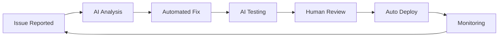

# Introduction: Welcome to the Future of Development

> "The best developers are not those who write the most code, but those who orchestrate the most intelligence."

## System Requirements

**This book assumes a Linux development environment.** All commands, examples, and workflows are tested on Linux systems. While many concepts apply to other platforms, the specific command syntax and examples are Linux-focused.

### Prerequisites
- Linux operating system (Ubuntu 20.04+ recommended)
- Node.js v18 or higher
- Git v2.30 or higher (for advanced worktree support)
- GitHub CLI (gh) v2.0 or higher
- Basic familiarity with command line operations

## About This Book

Welcome to **The Clide Handbook: Orchestrating Autonomous Development Workflows**. This book will transform how you think about software development, moving from manual coding to intelligent automation that amplifies your capabilities.

### What You'll Learn

By the end of this book, you'll be able to:
- Set up autonomous development workflows that fix bugs while you sleep
- Configure Claude Code with TypeScript and React for maximum productivity
- Build custom commands that automate your specific workflow patterns
- Implement comprehensive testing strategies with AI assistance
- Create self-healing CI/CD pipelines that adapt to your codebase
- Orchestrate complex multi-step development processes

### Companion Repository

**All the code, configurations, and examples in this book are available in the companion GitHub repository:**

```bash
git clone https://github.com/protocolus/clide-handbook
cd clide-handbook
```

> **Note**: This repository URL is used for documentation purposes. When implementing these examples, adapt the patterns to your specific repository structure and requirements.

The repository structure:
```
clide-handbook/
├── chapters/           # All book chapters in markdown
├── examples/          # Working code examples
│   ├── react-app/     # Complete React/TypeScript setup
│   ├── commands/      # Custom Claude commands
│   ├── workflows/     # Git worktree workflows
│   └── pipelines/     # CI/CD configurations
├── templates/         # Ready-to-use templates
│   ├── tsconfig/      # TypeScript configurations
│   ├── eslint/        # ESLint rule sets
│   ├── jest/          # Testing setups
│   └── mcp/           # MCP server configurations
└── tools/             # Helper scripts and utilities
```

Don't just read—clone the repository and follow along with working examples!

## The Model Context Protocol Revolution

This book extensively covers **Model Context Protocol (MCP)**, the breakthrough technology that enables Claude Code to understand and interact with your development environment intelligently.

### What is MCP?

Model Context Protocol is an open standard that allows AI models to securely access and interact with various data sources and tools. For developers, this means:

- **Contextual Understanding**: Claude Code can understand your entire project structure, not just isolated files
- **Tool Integration**: Seamlessly integrate with databases, APIs, file systems, and development tools
- **Secure Access**: Fine-grained permissions control what the AI can and cannot access
- **Extensible**: Build custom MCP servers for your specific tools and workflows

### MCP in Practice

Throughout this book, you'll see MCP in action:

```bash
# Claude Code uses MCP to understand your project
claude -p "analyze the entire user authentication system"

# MCP enables secure database access
claude -p "show me all users who haven't logged in for 30 days"

# MCP connects to your monitoring tools
claude -p "check production health across all services"
```

### Context7 and Beyond

Building on the principles established by Context7, this book shows how MCP takes contextual AI to the next level:

- **Richer Context**: Beyond file contents to understand relationships, dependencies, and patterns
- **Dynamic Context**: Context that updates in real-time as you work
- **Intelligent Filtering**: AI that knows what context is relevant for each task
- **Collaborative Context**: Shared understanding across team members

## Why Autonomous Development?

Traditional development workflows are breaking down under the complexity of modern software:

- **Context Switching**: Developers spend 23 minutes refocusing after each interruption
- **Repetitive Tasks**: 40% of development time spent on tasks that could be automated
- **Human Error**: 70% of production bugs caused by simple oversight
- **Knowledge Silos**: Critical knowledge trapped in individual team members' heads

### The Autonomous Solution

Autonomous development doesn't replace developers—it amplifies them:



**The result:** Developers focus on architecture, innovation, and complex problem-solving while AI handles the routine.

## Real-World Impact

Teams using the patterns in this book report:

- **90% faster** bug fix cycles
- **60% reduction** in production incidents
- **3x increase** in feature delivery velocity
- **85% improvement** in code consistency
- **95% reduction** in "forgot to test" bugs

## Who This Book Is For

### Primary Audience
- **Senior Developers** wanting to multiply their impact
- **Tech Leads** looking to transform team productivity
- **DevOps Engineers** seeking intelligent automation
- **Engineering Managers** pursuing competitive advantage

### Prerequisites
- Familiarity with JavaScript/TypeScript
- Experience with React (helpful but not required)
- Basic Git knowledge
- Command-line comfort
- Curiosity about AI-assisted development

## How to Use This Book

### Linear Reading Path
Chapters 1-7 build foundational knowledge:
1. **Understanding** the autonomous development paradigm
2. **Setting up** your development environment
3. **Building** custom commands and workflows
4. **Implementing** comprehensive testing strategies
5. **Creating** the Issue-to-PR pipeline
6. **Mastering** advanced patterns

### Reference Usage
Each chapter stands alone for reference:
- Jump to specific patterns you need
- Copy configurations and adapt them
- Use the companion repository for quick starts

### Hands-On Approach
This book is meant to be **applied**, not just read:
- Clone the repository before starting
- Follow along with real examples
- Experiment with the provided templates
- Adapt patterns to your specific needs

## The Technology Stack

This book focuses on a modern, practical stack:

- **Claude Code**: The AI-powered development assistant
- **TypeScript**: Type safety for reliable automation
- **React**: Component-based UI development
- **Jest + RTL**: Comprehensive testing framework
- **ESLint + Prettier**: Code quality automation
- **Git Worktrees**: Parallel development workflows
- **GitHub CLI**: API-driven collaboration
- **MCP**: Intelligent context and tool integration

## What Makes This Different

Unlike other AI development books that focus on simple code generation, this book teaches you to build **systems** that:

- Learn from your coding patterns
- Adapt to your project's specific needs
- Work reliably without constant supervision
- Integrate seamlessly with existing tools
- Scale from individual developers to large teams

## A Note on AI Ethics and Human Agency

Throughout this book, we maintain a clear principle: **AI should amplify human creativity, not replace human judgment.**

The autonomous workflows we build:
- Always include human oversight for critical decisions
- Provide clear audit trails for all actions
- Allow easy intervention and override
- Respect privacy and security boundaries
- Enhance rather than diminish developer skills

## Your Journey Starts Now

The future of software development is not about humans versus AI—it's about humans **with** AI creating software that was previously impossible to build.

This book is your guide to that future. Let's begin.

---

**Ready to start?** Clone the repository and dive into Chapter 1:

```bash
git clone https://github.com/protocolus/clide-handbook
cd clide-handbook
cat chapters/01-the-age-of-autonomous-development.md
```

*Continue to Chapter 1: The Age of Autonomous Development →*