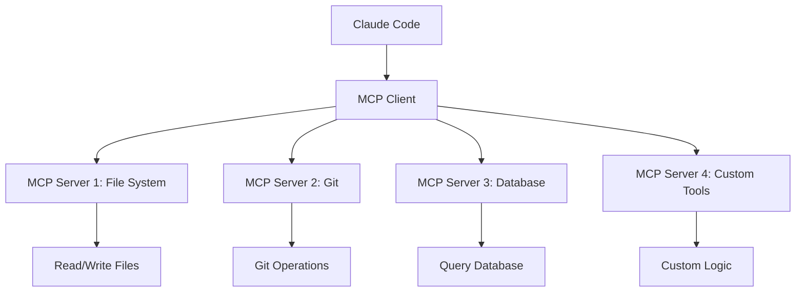

# Chapter 3: Setting Up Your Environment

> "A well-configured environment is the difference between fighting your tools and dancing with them."

## The Foundation of Autonomous Development

Before we dive into configuration files and command lines, let's acknowledge a truth: most developers spend their first week with new tools fighting configuration issues. We're going to compress that week into an hour, setting you up for success from the start.

This chapter will transform your development environment into an autonomous powerhouse, with TypeScript catching errors before they happen, ESLint enforcing consistency automatically, and Claude Code orchestrating it all.

## Prerequisites Checklist

Before we begin, ensure you have:

- **Node.js** (v18 or higher)
- **Git** (v2.30 or higher for worktree support)
- **A code editor** (VS Code recommended)
- **GitHub account** with CLI access
- **Terminal** with bash or zsh

Quick verification:
```bash
node --version  # Should show v18.x.x or higher
git --version   # Should show 2.30 or higher
gh --version    # GitHub CLI installed
```

## Installing Claude Code CLI

### Step 1: Install the CLI

```bash
npm install -g @anthropic/claude-code-cli

# Verify installation
claude --version
```

### Step 2: Authentication

```bash
# Set up your API key
claude auth login

# You'll be prompted for your Anthropic API key
# Get one at: https://console.anthropic.com/account/keys
```

### Step 3: Clone the Companion Repository

```bash
# Get all the book's examples and templates
git clone https://github.com/protocolus/clide-handbook
cd clide-handbook

# Copy example configurations to your project
cp -r examples/react-app/.claude ./
cp examples/react-app/.mcp.json ./
cp examples/react-app/tsconfig.json ./
```

### Step 4: Verify Setup

```bash
# Test basic functionality
claude -p "What version of Claude am I running?"

# Should respond with version information
```

## TypeScript Configuration for AI Development

TypeScript is crucial for autonomous development—it provides the guardrails that let AI code with confidence.

### The Ultimate tsconfig.json

Create a `tsconfig.json` that maximizes type safety:

```json
{
  "compilerOptions": {
    // Strict type checking
    "strict": true,
    "noImplicitAny": true,
    "strictNullChecks": true,
    "strictFunctionTypes": true,
    "strictBindCallApply": true,
    "strictPropertyInitialization": true,
    "noImplicitThis": true,
    "alwaysStrict": true,
    
    // Additional checks for AI safety
    "noUnusedLocals": true,
    "noUnusedParameters": true,
    "noImplicitReturns": true,
    "noFallthroughCasesInSwitch": true,
    "noUncheckedIndexedAccess": true,
    
    // React configuration
    "jsx": "react-jsx",
    "lib": ["dom", "dom.iterable", "esnext"],
    "module": "esnext",
    "target": "es2015",
    
    // Module resolution
    "moduleResolution": "node",
    "allowSyntheticDefaultImports": true,
    "esModuleInterop": true,
    "resolveJsonModule": true,
    "isolatedModules": true,
    
    // Output
    "noEmit": true,
    "skipLibCheck": true,
    "forceConsistentCasingInFileNames": true,
    
    // Path mapping
    "baseUrl": ".",
    "paths": {
      "@/*": ["src/*"],
      "@components/*": ["src/components/*"],
      "@hooks/*": ["src/hooks/*"],
      "@utils/*": ["src/utils/*"],
      "@types/*": ["src/types/*"]
    }
  },
  "include": [
    "src/**/*"
  ],
  "exclude": [
    "node_modules",
    "build",
    "dist",
    "coverage"
  ]
}
```

### TypeScript for React Components

Create a `src/types/react.d.ts` file for common React types:

```typescript
// Strict component prop types
export type StrictPropsWithChildren<P = {}> = P & {
  children?: React.ReactNode;
};

// Event handler types
export type ClickHandler = (event: React.MouseEvent<HTMLElement>) => void;
export type ChangeHandler = (event: React.ChangeEvent<HTMLInputElement>) => void;
export type FormHandler = (event: React.FormEvent<HTMLFormElement>) => void;

// Async component props
export type AsyncComponentProps<T> = {
  loading?: boolean;
  error?: Error | null;
  data?: T;
  retry?: () => void;
};

// Strict form types
export interface FormField<T = string> {
  value: T;
  error?: string;
  touched?: boolean;
  required?: boolean;
}
```

## ESLint Configuration for Autonomous Workflows

ESLint becomes even more critical when AI is writing code. Here's a configuration that ensures consistency:

### .eslintrc.js

```javascript
module.exports = {
  root: true,
  parser: '@typescript-eslint/parser',
  parserOptions: {
    ecmaVersion: 2020,
    sourceType: 'module',
    ecmaFeatures: {
      jsx: true,
    },
    project: './tsconfig.json',
  },
  settings: {
    react: {
      version: 'detect',
    },
  },
  extends: [
    'eslint:recommended',
    'plugin:@typescript-eslint/recommended',
    'plugin:@typescript-eslint/recommended-requiring-type-checking',
    'plugin:react/recommended',
    'plugin:react-hooks/recommended',
    'plugin:jsx-a11y/recommended',
    'plugin:testing-library/react',
    'plugin:jest-dom/recommended',
    'prettier',
  ],
  plugins: [
    '@typescript-eslint',
    'react',
    'react-hooks',
    'jsx-a11y',
    'testing-library',
    'jest-dom',
  ],
  rules: {
    // TypeScript specific rules
    '@typescript-eslint/explicit-function-return-type': 'error',
    '@typescript-eslint/no-explicit-any': 'error',
    '@typescript-eslint/no-unused-vars': ['error', { 
      argsIgnorePattern: '^_',
      varsIgnorePattern: '^_',
    }],
    '@typescript-eslint/no-floating-promises': 'error',
    '@typescript-eslint/no-misused-promises': 'error',
    '@typescript-eslint/await-thenable': 'error',
    
    // React specific rules
    'react/prop-types': 'off', // We use TypeScript
    'react/react-in-jsx-scope': 'off', // React 17+
    'react/jsx-uses-react': 'off',
    'react/jsx-filename-extension': ['error', { 
      extensions: ['.tsx'] 
    }],
    'react/jsx-props-no-spreading': 'warn',
    'react/no-array-index-key': 'error',
    
    // Hooks rules
    'react-hooks/rules-of-hooks': 'error',
    'react-hooks/exhaustive-deps': 'error',
    
    // General best practices
    'no-console': ['warn', { 
      allow: ['warn', 'error'] 
    }],
    'prefer-const': 'error',
    'no-var': 'error',
    'eqeqeq': ['error', 'always'],
    
    // Accessibility
    'jsx-a11y/anchor-is-valid': 'error',
    'jsx-a11y/click-events-have-key-events': 'error',
    'jsx-a11y/no-static-element-interactions': 'error',
  },
  overrides: [
    {
      // Test file rules
      files: ['**/*.test.{ts,tsx}', '**/*.spec.{ts,tsx}'],
      env: {
        jest: true,
      },
      rules: {
        '@typescript-eslint/no-explicit-any': 'off',
        '@typescript-eslint/no-non-null-assertion': 'off',
      },
    },
  ],
};
```

### ESLint Scripts

Add these to your `package.json`:

```json
{
  "scripts": {
    "lint": "eslint . --ext .js,.jsx,.ts,.tsx",
    "lint:fix": "eslint . --ext .js,.jsx,.ts,.tsx --fix",
    "lint:staged": "lint-staged",
    "type-check": "tsc --noEmit",
    "validate": "npm run type-check && npm run lint && npm run test"
  },
  "lint-staged": {
    "*.{js,jsx,ts,tsx}": [
      "eslint --fix",
      "prettier --write"
    ]
  }
}
```

## Prettier Integration

Consistent formatting is crucial for AI-generated code:

### .prettierrc

```json
{
  "semi": true,
  "trailingComma": "es5",
  "singleQuote": true,
  "printWidth": 80,
  "tabWidth": 2,
  "useTabs": false,
  "arrowParens": "avoid",
  "endOfLine": "lf",
  "bracketSpacing": true,
  "jsxBracketSameLine": false,
  "proseWrap": "preserve"
}
```

### .prettierignore

```
node_modules
build
dist
coverage
.next
.cache
public
*.min.js
*.d.ts
```

## Model Context Protocol (MCP) Setup

MCP is the foundation that enables Claude Code to understand your project deeply and interact with tools securely.

### Understanding MCP Architecture



### Core MCP Configuration

Create the main MCP configuration:

#### .mcp.json

```json
{
  "mcpServers": {
    "filesystem": {
      "command": "npx",
      "args": ["@modelcontextprotocol/server-filesystem", "/path/to/allowed/dir"],
      "env": {
        "ALLOWED_DIRS": "src,tests,docs,.claude"
      }
    },
    "git": {
      "command": "npx", 
      "args": ["@modelcontextprotocol/server-git", "--repository", "."]
    },
    "brave-search": {
      "command": "npx",
      "args": ["@modelcontextprotocol/server-brave-search"],
      "env": {
        "BRAVE_API_KEY": "your-api-key"
      }
    },
    "github": {
      "command": "npx",
      "args": ["@modelcontextprotocol/server-github"],
      "env": {
        "GITHUB_PERSONAL_ACCESS_TOKEN": "your-token"
      }
    },
    "sentry": {
      "command": "npx",
      "args": ["@modelcontextprotocol/server-sentry"],
      "env": {
        "SENTRY_AUTH_TOKEN": "your-sentry-auth-token",
        "SENTRY_ORG": "your-org-slug",
        "SENTRY_PROJECT": "your-project-slug"
      }
    }
  },
  "tools": {
    "read": {
      "enabled": true,
      "maxFileSize": "1MB",
      "allowedExtensions": [".ts", ".tsx", ".js", ".jsx", ".json", ".md"]
    },
    "edit": {
      "enabled": true,
      "requiresConfirmation": false,
      "backupEnabled": true
    },
    "write": {
      "enabled": true,
      "allowedPaths": ["src/**", "tests/**", "docs/**", ".claude/**"]
    },
    "bash": {
      "enabled": true,
      "allowedCommands": [
        "git",
        "npm", "yarn", "pnpm",
        "jest", "vitest",
        "eslint", "prettier", "tsc",
        "gh", "curl", "jq"
      ],
      "restrictedCommands": [
        "rm -rf /",
        "sudo",
        "chmod 777",
        "wget",
        "docker run --privileged"
      ],
      "timeout": 30000,
      "workingDirectory": "."
    }
  },
  "context": {
    "includePatterns": [
      "**/*.{ts,tsx,js,jsx}",
      "**/*.{json,md,yml,yaml}",
      "**/package.json",
      "**/tsconfig.json",
      "**/.eslintrc*",
      "**/.prettierrc*"
    ],
    "excludePatterns": [
      "**/node_modules/**",
      "**/.git/**",
      "**/build/**",
      "**/dist/**",
      "**/*.min.js",
      "**/coverage/**"
    ],
    "maxFiles": 100,
    "maxFileSize": "500KB",
    "priorityPatterns": [
      "src/**/*.ts",
      "src/**/*.tsx",
      "**/*.test.ts",
      "**/*.test.tsx"
    ]
  },
  "security": {
    "sandboxMode": true,
    "allowNetworkAccess": ["github.com", "api.github.com"],
    "allowEnvironmentAccess": [
      "NODE_ENV",
      "CI",
      "GITHUB_TOKEN"
    ],
    "denyPatterns": [
      "**/.env*",
      "**/secrets/**",
      "**/*key*",
      "**/*password*"
    ]
  },
  "behavior": {
    "autoCommit": false,
    "autoPush": false,
    "testBeforeCommit": true,
    "lintBeforeCommit": true,
    "verboseMode": true,
    "pauseOnError": true
  }
}
```

### Custom MCP Server

Create a custom MCP server for project-specific tools:

#### .claude/mcp-server/project-tools.js

```javascript
#!/usr/bin/env node

import { Server } from '@modelcontextprotocol/sdk/server/index.js';
import { StdioServerTransport } from '@modelcontextprotocol/sdk/server/stdio.js';
import {
  ListToolsRequestSchema,
  CallToolRequestSchema,
  ErrorCode,
  McpError,
} from '@modelcontextprotocol/sdk/types.js';
import { exec } from 'child_process';
import { promisify } from 'util';
import fs from 'fs/promises';
import path from 'path';

const execAsync = promisify(exec);

class ProjectToolsServer {
  constructor() {
    this.server = new Server(
      {
        name: 'project-tools',
        version: '1.0.0',
      },
      {
        capabilities: {
          tools: {},
        },
      }
    );

    this.setupToolHandlers();
    this.setupErrorHandling();
  }

  setupToolHandlers() {
    this.server.setRequestHandler(ListToolsRequestSchema, async () => ({
      tools: [
        {
          name: 'analyze-bundle-size',
          description: 'Analyze bundle size and provide optimization suggestions',
          inputSchema: {
            type: 'object',
            properties: {
              buildPath: {
                type: 'string',
                description: 'Path to built files',
                default: 'dist'
              }
            }
          }
        },
        {
          name: 'run-lighthouse',
          description: 'Run Lighthouse performance analysis',
          inputSchema: {
            type: 'object',
            properties: {
              url: {
                type: 'string',
                description: 'URL to analyze'
              },
              preset: {
                type: 'string',
                enum: ['mobile', 'desktop'],
                default: 'mobile'
              }
            },
            required: ['url']
          }
        },
        {
          name: 'check-dependencies',
          description: 'Check for outdated dependencies and security vulnerabilities',
          inputSchema: {
            type: 'object',
            properties: {
              fix: {
                type: 'boolean',
                description: 'Automatically fix issues where possible',
                default: false
              },
              severity: {
                type: 'string',
                enum: ['info', 'low', 'moderate', 'high', 'critical'],
                description: 'Minimum severity level to report',
                default: 'moderate'
              },
              packageManager: {
                type: 'string',
                enum: ['npm', 'yarn', 'pnpm'],
                description: 'Package manager to use',
                default: 'npm'
              }
            }
          }
        },
        {
          name: 'audit-packages',
          description: 'Comprehensive security audit of all packages',
          inputSchema: {
            type: 'object',
            properties: {
              format: {
                type: 'string',
                enum: ['json', 'table', 'summary'],
                default: 'summary'
              },
              production: {
                type: 'boolean',
                description: 'Only audit production dependencies',
                default: false
              }
            }
          }
        },
        {
          name: 'update-packages',
          description: 'Update outdated packages with intelligent conflict resolution',
          inputSchema: {
            type: 'object',
            properties: {
              strategy: {
                type: 'string',
                enum: ['patch', 'minor', 'major', 'interactive'],
                description: 'Update strategy',
                default: 'minor'
              },
              dryRun: {
                type: 'boolean',
                description: 'Show what would be updated without making changes',
                default: true
              },
              testAfter: {
                type: 'boolean',
                description: 'Run tests after updates',
                default: true
              }
            }
          }
        },
        {
          name: 'analyze-package-health',
          description: 'Analyze overall package ecosystem health and recommendations',
          inputSchema: {
            type: 'object',
            properties: {
              includeMetrics: {
                type: 'boolean',
                description: 'Include download stats and maintenance metrics',
                default: true
              }
            }
          }
        },
        {
          name: 'generate-api-docs',
          description: 'Generate API documentation from TypeScript interfaces',
          inputSchema: {
            type: 'object',
            properties: {
              inputDir: {
                type: 'string',
                default: 'src/types'
              },
              outputDir: {
                type: 'string', 
                default: 'docs/api'
              }
            }
          }
        },
        {
          name: 'build-openapi-spec',
          description: 'Generate OpenAPI specification from code annotations and types',
          inputSchema: {
            type: 'object',
            properties: {
              sourceDir: {
                type: 'string',
                description: 'Directory containing API routes/controllers',
                default: 'src/api'
              },
              outputFile: {
                type: 'string',
                description: 'Output OpenAPI spec file',
                default: 'docs/openapi.yaml'
              },
              format: {
                type: 'string',
                enum: ['yaml', 'json'],
                default: 'yaml'
              },
              includeExamples: {
                type: 'boolean',
                description: 'Include request/response examples',
                default: true
              }
            }
          }
        },
        {
          name: 'generate-postman-collection',
          description: 'Create Postman collection from OpenAPI specification',
          inputSchema: {
            type: 'object',
            properties: {
              openApiFile: {
                type: 'string',
                description: 'Path to OpenAPI specification file',
                default: 'docs/openapi.yaml'
              },
              outputFile: {
                type: 'string',
                description: 'Output Postman collection file',
                default: 'docs/postman-collection.json'
              },
              baseUrl: {
                type: 'string',
                description: 'Base URL for API requests',
                default: 'http://localhost:3000'
              },
              includeAuth: {
                type: 'boolean',
                description: 'Include authentication setup',
                default: true
              }
            }
          }
        },
        {
          name: 'generate-api-tests',
          description: 'Generate comprehensive test suite from OpenAPI specification',
          inputSchema: {
            type: 'object',
            properties: {
              openApiFile: {
                type: 'string',
                description: 'Path to OpenAPI specification file',
                default: 'docs/openapi.yaml'
              },
              testFramework: {
                type: 'string',
                enum: ['jest', 'vitest', 'mocha'],
                description: 'Testing framework to use',
                default: 'jest'
              },
              outputDir: {
                type: 'string',
                description: 'Directory for generated tests',
                default: 'tests/api'
              },
              includeContractTests: {
                type: 'boolean',
                description: 'Include API contract validation tests',
                default: true
              }
            }
          }
        },
        {
          name: 'host-api-docs',
          description: 'Host interactive API documentation with live testing',
          inputSchema: {
            type: 'object',
            properties: {
              openApiFile: {
                type: 'string',
                description: 'Path to OpenAPI specification file',
                default: 'docs/openapi.yaml'
              },
              port: {
                type: 'number',
                description: 'Port to host documentation on',
                default: 8080
              },
              theme: {
                type: 'string',
                enum: ['swagger-ui', 'redoc', 'rapidoc'],
                description: 'Documentation theme/tool',
                default: 'swagger-ui'
              },
              enableTryIt: {
                type: 'boolean',
                description: 'Enable live API testing in docs',
                default: true
              }
            }
          }
        },
        {
          name: 'validate-openapi',
          description: 'Validate OpenAPI specification and check for issues',
          inputSchema: {
            type: 'object',
            properties: {
              openApiFile: {
                type: 'string',
                description: 'Path to OpenAPI specification file',
                default: 'docs/openapi.yaml'
              },
              strict: {
                type: 'boolean',
                description: 'Enable strict validation rules',
                default: true
              }
            }
          }
        },
        {
          name: 'analyze-sentry-errors',
          description: 'Analyze recent Sentry errors and suggest fixes',
          inputSchema: {
            type: 'object',
            properties: {
              timeRange: {
                type: 'string',
                enum: ['1h', '24h', '7d', '30d'],
                default: '24h'
              },
              environment: {
                type: 'string',
                default: 'production'
              },
              autoFix: {
                type: 'boolean',
                description: 'Attempt to create fixes for common errors',
                default: false
              }
            }
          }
        },
        {
          name: 'create-sentry-release',
          description: 'Create a new Sentry release with commits and deploy info',
          inputSchema: {
            type: 'object',
            properties: {
              version: {
                type: 'string',
                description: 'Release version (e.g., 1.0.0 or git SHA)'
              },
              environment: {
                type: 'string',
                default: 'production'
              },
              uploadSourcemaps: {
                type: 'boolean',
                default: true
              }
            },
            required: ['version']
          }
        },
        {
          name: 'check-error-budget',
          description: 'Check current error budget and alert if threshold exceeded',
          inputSchema: {
            type: 'object',
            properties: {
              threshold: {
                type: 'number',
                description: 'Error rate threshold percentage',
                default: 1.0
              },
              period: {
                type: 'string',
                enum: ['1h', '6h', '24h'],
                default: '1h'
              }
            }
          }
        }
      ]
    }));

    this.server.setRequestHandler(CallToolRequestSchema, async (request) => {
      try {
        switch (request.params.name) {
          case 'analyze-bundle-size':
            return await this.analyzeBundleSize(request.params.arguments);
          case 'run-lighthouse':
            return await this.runLighthouse(request.params.arguments);
          case 'check-dependencies':
            return await this.checkDependencies(request.params.arguments);
          case 'audit-packages':
            return await this.auditPackages(request.params.arguments);
          case 'update-packages':
            return await this.updatePackages(request.params.arguments);
          case 'analyze-package-health':
            return await this.analyzePackageHealth(request.params.arguments);
          case 'generate-api-docs':
            return await this.generateApiDocs(request.params.arguments);
          case 'build-openapi-spec':
            return await this.buildOpenApiSpec(request.params.arguments);
          case 'generate-postman-collection':
            return await this.generatePostmanCollection(request.params.arguments);
          case 'generate-api-tests':
            return await this.generateApiTests(request.params.arguments);
          case 'host-api-docs':
            return await this.hostApiDocs(request.params.arguments);
          case 'validate-openapi':
            return await this.validateOpenApi(request.params.arguments);
          case 'analyze-sentry-errors':
            return await this.analyzeSentryErrors(request.params.arguments);
          case 'create-sentry-release':
            return await this.createSentryRelease(request.params.arguments);
          case 'check-error-budget':
            return await this.checkErrorBudget(request.params.arguments);
          default:
            throw new McpError(
              ErrorCode.MethodNotFound,
              `Unknown tool: ${request.params.name}`
            );
        }
      } catch (error) {
        throw new McpError(
          ErrorCode.InternalError,
          `Tool execution failed: ${error.message}`
        );
      }
    });
  }

  async analyzeBundleSize(args) {
    const { buildPath = 'dist' } = args || {};
    
    try {
      const { stdout } = await execAsync(`npm run build -- --analyze`);
      const buildFiles = await fs.readdir(buildPath);
      
      const sizeAnalysis = [];
      for (const file of buildFiles) {
        if (file.endsWith('.js') || file.endsWith('.css')) {
          const filePath = path.join(buildPath, file);
          const stats = await fs.stat(filePath);
          sizeAnalysis.push({
            file,
            size: stats.size,
            sizeFormatted: this.formatBytes(stats.size)
          });
        }
      }

      const totalSize = sizeAnalysis.reduce((sum, item) => sum + item.size, 0);
      
      return {
        content: [
          {
            type: 'text',
            text: JSON.stringify({
              totalSize: this.formatBytes(totalSize),
              files: sizeAnalysis.sort((a, b) => b.size - a.size),
              recommendations: this.getBundleOptimizationTips(sizeAnalysis)
            }, null, 2)
          }
        ]
      };
    } catch (error) {
      throw new Error(`Bundle analysis failed: ${error.message}`);
    }
  }

  async runLighthouse(args) {
    const { url, preset = 'mobile' } = args;
    
    if (!url) {
      throw new Error('URL is required for Lighthouse analysis');
    }

    try {
      const configFlag = preset === 'mobile' ? '--preset=perf' : '--preset=desktop';
      const { stdout } = await execAsync(
        `npx lighthouse ${url} ${configFlag} --output json --quiet`
      );
      
      const report = JSON.parse(stdout);
      
      return {
        content: [
          {
            type: 'text',
            text: JSON.stringify({
              url,
              performance: report.lhr.categories.performance.score * 100,
              accessibility: report.lhr.categories.accessibility.score * 100,
              bestPractices: report.lhr.categories['best-practices'].score * 100,
              seo: report.lhr.categories.seo.score * 100,
              metrics: {
                firstContentfulPaint: report.lhr.audits['first-contentful-paint'].displayValue,
                largestContentfulPaint: report.lhr.audits['largest-contentful-paint'].displayValue,
                speedIndex: report.lhr.audits['speed-index'].displayValue,
                timeToInteractive: report.lhr.audits['interactive'].displayValue
              },
              opportunities: report.lhr.audits['opportunities'] || []
            }, null, 2)
          }
        ]
      };
    } catch (error) {
      throw new Error(`Lighthouse analysis failed: ${error.message}`);
    }
  }

  async checkDependencies(args) {
    const { fix = false, severity = 'moderate', packageManager = 'npm' } = args || {};
    
    try {
      const results = {
        packageManager,
        timestamp: new Date().toISOString(),
        outdated: {},
        vulnerabilities: {},
        summary: {}
      };

      // Check for outdated packages
      try {
        const outdatedCmd = {
          npm: 'npm outdated --json',
          yarn: 'yarn outdated --json',
          pnpm: 'pnpm outdated --format json'
        }[packageManager];

        const { stdout: outdated } = await execAsync(outdatedCmd).catch(() => ({ stdout: '{}' }));
        const outdatedPackages = JSON.parse(outdated);
        
        results.outdated = {
          count: Object.keys(outdatedPackages).length,
          packages: this.categorizeOutdatedPackages(outdatedPackages),
          critical: this.findCriticalUpdates(outdatedPackages)
        };
      } catch (error) {
        results.outdated.error = error.message;
      }

      // Security audit
      try {
        const auditCmd = {
          npm: 'npm audit --json',
          yarn: 'yarn audit --json',
          pnpm: 'pnpm audit --json'
        }[packageManager];

        const { stdout: audit } = await execAsync(auditCmd).catch(() => ({ stdout: '{"vulnerabilities":{}}' }));
        const auditResult = JSON.parse(audit);
        
        results.vulnerabilities = this.processAuditResults(auditResult, severity);
      } catch (error) {
        results.vulnerabilities.error = error.message;
      }

      // Generate summary and recommendations
      results.summary = this.generateDependencySummary(results);

      // Apply fixes if requested
      if (fix) {
        results.fixes = await this.applyDependencyFixes(packageManager, results);
      }

      return {
        content: [
          {
            type: 'text',
            text: JSON.stringify(results, null, 2)
          }
        ]
      };
    } catch (error) {
      throw new Error(`Dependency check failed: ${error.message}`);
    }
  }

  async auditPackages(args) {
    const { format = 'summary', production = false } = args || {};
    
    try {
      // Run comprehensive security audit
      const auditCmd = production ? 'npm audit --production --json' : 'npm audit --json';
      const { stdout: auditOutput } = await execAsync(auditCmd).catch(() => ({ stdout: '{"vulnerabilities":{}}' }));
      const auditData = JSON.parse(auditOutput);

      // Get additional security information
      const { stdout: licenseCheck } = await execAsync('npx license-checker --json').catch(() => ({ stdout: '{}' }));
      const licenses = JSON.parse(licenseCheck);

      const analysis = {
        securityAudit: this.analyzeSecurityAudit(auditData),
        licenseAnalysis: this.analyzeLicenses(licenses),
        recommendations: this.generateSecurityRecommendations(auditData),
        riskAssessment: this.assessSecurityRisk(auditData)
      };

      const output = format === 'json' ? analysis :
                    format === 'table' ? this.formatAuditTable(analysis) :
                    this.formatAuditSummary(analysis);

      return {
        content: [
          {
            type: 'text',
            text: typeof output === 'string' ? output : JSON.stringify(output, null, 2)
          }
        ]
      };
    } catch (error) {
      throw new Error(`Package audit failed: ${error.message}`);
    }
  }

  async updatePackages(args) {
    const { strategy = 'minor', dryRun = true, testAfter = true } = args || {};
    
    try {
      const results = {
        strategy,
        dryRun,
        timestamp: new Date().toISOString(),
        updates: [],
        conflicts: [],
        testResults: null
      };

      // Get list of outdated packages
      const { stdout: outdated } = await execAsync('npm outdated --json').catch(() => ({ stdout: '{}' }));
      const outdatedPackages = JSON.parse(outdated);

      // Filter packages based on strategy
      const packagesToUpdate = this.filterPackagesByStrategy(outdatedPackages, strategy);
      
      if (packagesToUpdate.length === 0) {
        results.message = 'No packages to update based on strategy';
        return {
          content: [{ type: 'text', text: JSON.stringify(results, null, 2) }]
        };
      }

      // Perform updates
      if (dryRun) {
        results.plannedUpdates = packagesToUpdate.map(pkg => ({
          name: pkg.name,
          current: pkg.current,
          wanted: pkg.wanted,
          latest: pkg.latest,
          updateType: this.getUpdateType(pkg.current, pkg.wanted)
        }));
      } else {
        // Backup package.json
        await execAsync('cp package.json package.json.backup');
        
        try {
          // Apply updates
          for (const pkg of packagesToUpdate) {
            const updateCmd = `npm install ${pkg.name}@${pkg.wanted}`;
            await execAsync(updateCmd);
            results.updates.push({
              name: pkg.name,
              from: pkg.current,
              to: pkg.wanted,
              status: 'success'
            });
          }

          // Run tests if requested
          if (testAfter) {
            try {
              const { stdout: testOutput } = await execAsync('npm test');
              results.testResults = { status: 'passed', output: testOutput };
            } catch (testError) {
              results.testResults = { status: 'failed', error: testError.message };
              // Restore backup on test failure
              await execAsync('cp package.json.backup package.json');
              await execAsync('npm install');
            }
          }
        } catch (updateError) {
          // Restore backup on update failure
          await execAsync('cp package.json.backup package.json');
          await execAsync('npm install');
          throw updateError;
        }
      }

      return {
        content: [
          {
            type: 'text',
            text: JSON.stringify(results, null, 2)
          }
        ]
      };
    } catch (error) {
      throw new Error(`Package update failed: ${error.message}`);
    }
  }

  async analyzePackageHealth(args) {
    const { includeMetrics = true } = args || {};
    
    try {
      // Read package.json
      const packageJson = JSON.parse(await fs.readFile('package.json', 'utf8'));
      const dependencies = { ...packageJson.dependencies, ...packageJson.devDependencies };

      const healthAnalysis = {
        overview: {
          totalPackages: Object.keys(dependencies).length,
          productionDeps: Object.keys(packageJson.dependencies || {}).length,
          devDeps: Object.keys(packageJson.devDependencies || {}).length
        },
        healthScore: 0,
        issues: [],
        recommendations: []
      };

      // Analyze each package
      const packageAnalysis = [];
      for (const [name, version] of Object.entries(dependencies)) {
        const analysis = await this.analyzeIndividualPackage(name, version, includeMetrics);
        packageAnalysis.push(analysis);
      }

      // Calculate overall health score
      healthAnalysis.healthScore = this.calculateHealthScore(packageAnalysis);
      
      // Identify issues
      healthAnalysis.issues = this.identifyPackageIssues(packageAnalysis);
      
      // Generate recommendations
      healthAnalysis.recommendations = this.generatePackageRecommendations(packageAnalysis);
      
      // Bundle size analysis
      healthAnalysis.bundleImpact = await this.analyzeBundleImpact(dependencies);

      return {
        content: [
          {
            type: 'text',
            text: JSON.stringify(healthAnalysis, null, 2)
          }
        ]
      };
    } catch (error) {
      throw new Error(`Package health analysis failed: ${error.message}`);
    }
  }

  categorizeOutdatedPackages(packages) {
    const categories = {
      major: [],
      minor: [],
      patch: [],
      prerelease: []
    };

    for (const [name, info] of Object.entries(packages)) {
      const updateType = this.getUpdateType(info.current, info.wanted);
      categories[updateType].push({ name, ...info });
    }

    return categories;
  }

  findCriticalUpdates(packages) {
    return Object.entries(packages)
      .filter(([name, info]) => {
        // Critical security packages or major framework updates
        const criticalPackages = ['react', 'next', 'express', 'lodash', '@types/node'];
        return criticalPackages.includes(name) || this.getUpdateType(info.current, info.wanted) === 'major';
      })
      .map(([name, info]) => ({ name, ...info }));
  }

  processAuditResults(auditResult, minSeverity) {
    const severityLevels = { info: 0, low: 1, moderate: 2, high: 3, critical: 4 };
    const minLevel = severityLevels[minSeverity];

    const vulnerabilities = auditResult.vulnerabilities || {};
    const filtered = Object.entries(vulnerabilities)
      .filter(([_, vuln]) => severityLevels[vuln.severity] >= minLevel)
      .reduce((acc, [key, value]) => {
        acc[key] = value;
        return acc;
      }, {});

    return {
      total: Object.keys(vulnerabilities).length,
      filtered: Object.keys(filtered).length,
      bySeverity: this.groupVulnerabilitiesBySeverity(vulnerabilities),
      details: filtered
    };
  }

  generateDependencySummary(results) {
    const summary = {
      status: 'healthy',
      score: 100,
      issues: []
    };

    // Deduct points for outdated packages
    if (results.outdated.count > 0) {
      summary.score -= Math.min(results.outdated.count * 2, 30);
      summary.issues.push(`${results.outdated.count} outdated packages`);
    }

    // Deduct points for vulnerabilities
    const vulnCount = results.vulnerabilities.filtered || 0;
    if (vulnCount > 0) {
      summary.score -= Math.min(vulnCount * 10, 50);
      summary.issues.push(`${vulnCount} security vulnerabilities`);
      summary.status = vulnCount > 5 ? 'critical' : 'warning';
    }

    summary.score = Math.max(summary.score, 0);
    
    if (summary.score >= 80) summary.status = 'healthy';
    else if (summary.score >= 60) summary.status = 'warning';
    else summary.status = 'critical';

    return summary;
  }

  async applyDependencyFixes(packageManager, results) {
    const fixes = { applied: [], failed: [] };

    try {
      // Fix security vulnerabilities first
      if (results.vulnerabilities.filtered > 0) {
        const auditFixCmd = {
          npm: 'npm audit fix',
          yarn: 'yarn audit fix',
          pnpm: 'pnpm audit --fix'
        }[packageManager];

        try {
          await execAsync(auditFixCmd);
          fixes.applied.push('Security vulnerabilities fixed');
        } catch (error) {
          fixes.failed.push(`Audit fix failed: ${error.message}`);
        }
      }

      // Update patch-level dependencies
      if (results.outdated.packages.patch?.length > 0) {
        try {
          await execAsync(`${packageManager} update`);
          fixes.applied.push('Patch-level updates applied');
        } catch (error) {
          fixes.failed.push(`Patch updates failed: ${error.message}`);
        }
      }

    } catch (error) {
      fixes.failed.push(`General fix error: ${error.message}`);
    }

    return fixes;
  }

  getUpdateType(current, wanted) {
    if (!current || !wanted) return 'unknown';
    
    const currentParts = current.replace(/[^0-9.]/g, '').split('.');
    const wantedParts = wanted.replace(/[^0-9.]/g, '').split('.');
    
    if (currentParts[0] !== wantedParts[0]) return 'major';
    if (currentParts[1] !== wantedParts[1]) return 'minor';
    if (currentParts[2] !== wantedParts[2]) return 'patch';
    
    return 'prerelease';
  }

  analyzeSecurityAudit(auditData) {
    return {
      totalVulnerabilities: Object.keys(auditData.vulnerabilities || {}).length,
      severity: this.groupVulnerabilitiesBySeverity(auditData.vulnerabilities || {}),
      advisories: auditData.advisories || {},
      metadata: auditData.metadata || {}
    };
  }

  groupVulnerabilitiesBySeverity(vulnerabilities) {
    const groups = { info: 0, low: 0, moderate: 0, high: 0, critical: 0 };
    
    Object.values(vulnerabilities).forEach(vuln => {
      if (groups.hasOwnProperty(vuln.severity)) {
        groups[vuln.severity]++;
      }
    });
    
    return groups;
  }

  async analyzeIndividualPackage(name, version, includeMetrics) {
    const analysis = { name, version, issues: [], score: 100 };
    
    if (includeMetrics) {
      // This would typically call npm registry API
      // Simplified for example
      analysis.metrics = {
        weeklyDownloads: 'unknown',
        lastPublished: 'unknown',
        maintainers: 'unknown'
      };
    }

    return analysis;
  }

  calculateHealthScore(packageAnalysis) {
    if (packageAnalysis.length === 0) return 100;
    
    const totalScore = packageAnalysis.reduce((sum, pkg) => sum + pkg.score, 0);
    return Math.round(totalScore / packageAnalysis.length);
  }

  identifyPackageIssues(packageAnalysis) {
    return packageAnalysis
      .filter(pkg => pkg.score < 80)
      .map(pkg => ({
        package: pkg.name,
        issues: pkg.issues,
        score: pkg.score
      }));
  }

  generatePackageRecommendations(packageAnalysis) {
    const recommendations = [];
    
    const lowScorePackages = packageAnalysis.filter(pkg => pkg.score < 60);
    if (lowScorePackages.length > 0) {
      recommendations.push(`Consider replacing or updating: ${lowScorePackages.map(p => p.name).join(', ')}`);
    }
    
    return recommendations;
  }

  async analyzeBundleImpact(dependencies) {
    // Simplified bundle analysis
    return {
      estimatedSize: Object.keys(dependencies).length * 50 + 'KB',
      largestDependencies: Object.keys(dependencies).slice(0, 5)
    };
  }

  filterPackagesByStrategy(packages, strategy) {
    const filtered = [];
    
    for (const [name, info] of Object.entries(packages)) {
      const updateType = this.getUpdateType(info.current, info.wanted);
      
      switch (strategy) {
        case 'patch':
          if (updateType === 'patch') filtered.push({ name, ...info });
          break;
        case 'minor':
          if (['patch', 'minor'].includes(updateType)) filtered.push({ name, ...info });
          break;
        case 'major':
          filtered.push({ name, ...info });
          break;
        case 'interactive':
          // Would require user interaction in real implementation
          filtered.push({ name, ...info });
          break;
      }
    }
    
    return filtered;
  }

  analyzeLicenses(licenses) {
    const licenseTypes = {};
    const problematic = [];
    
    for (const [pkg, info] of Object.entries(licenses)) {
      const license = info.licenses || 'Unknown';
      licenseTypes[license] = (licenseTypes[license] || 0) + 1;
      
      // Flag potentially problematic licenses
      if (['GPL', 'AGPL', 'LGPL'].some(l => license.includes(l))) {
        problematic.push({ package: pkg, license });
      }
    }
    
    return {
      totalPackages: Object.keys(licenses).length,
      licenseDistribution: licenseTypes,
      problematicLicenses: problematic
    };
  }

  generateSecurityRecommendations(auditData) {
    const recommendations = [];
    const vulnerabilities = auditData.vulnerabilities || {};
    
    const criticalCount = Object.values(vulnerabilities)
      .filter(v => v.severity === 'critical').length;
    
    if (criticalCount > 0) {
      recommendations.push(`URGENT: ${criticalCount} critical vulnerabilities require immediate attention`);
    }
    
    const highCount = Object.values(vulnerabilities)
      .filter(v => v.severity === 'high').length;
    
    if (highCount > 0) {
      recommendations.push(`${highCount} high-severity vulnerabilities should be addressed soon`);
    }
    
    return recommendations;
  }

  assessSecurityRisk(auditData) {
    const vulnerabilities = auditData.vulnerabilities || {};
    const vulnArray = Object.values(vulnerabilities);
    
    const critical = vulnArray.filter(v => v.severity === 'critical').length;
    const high = vulnArray.filter(v => v.severity === 'high').length;
    const moderate = vulnArray.filter(v => v.severity === 'moderate').length;
    
    let riskScore = critical * 10 + high * 5 + moderate * 2;
    let riskLevel = 'low';
    
    if (riskScore >= 50) riskLevel = 'critical';
    else if (riskScore >= 20) riskLevel = 'high';
    else if (riskScore >= 10) riskLevel = 'moderate';
    
    return {
      score: riskScore,
      level: riskLevel,
      breakdown: { critical, high, moderate }
    };
  }

  formatAuditTable(analysis) {
    let table = '\n┌─────────────────────────────────────────┐\n';
    table += '│           Security Audit Report         │\n';
    table += '├─────────────────────────────────────────┤\n';
    table += `│ Risk Level: ${analysis.riskAssessment.level.padEnd(27)} │\n`;
    table += `│ Total Vulnerabilities: ${String(analysis.securityAudit.totalVulnerabilities).padEnd(16)} │\n`;
    table += '├─────────────────────────────────────────┤\n';
    table += '│ Severity Breakdown:                     │\n';
    
    const severity = analysis.securityAudit.severity;
    Object.entries(severity).forEach(([level, count]) => {
      if (count > 0) {
        table += `│ ${level.padEnd(10)}: ${String(count).padEnd(25)} │\n`;
      }
    });
    
    table += '└─────────────────────────────────────────┘\n';
    return table;
  }

  formatAuditSummary(analysis) {
    const { riskAssessment, securityAudit, recommendations } = analysis;
    
    let summary = `🔒 Security Audit Summary\n`;
    summary += `═══════════════════════════\n\n`;
    summary += `Risk Level: ${riskAssessment.level.toUpperCase()}\n`;
    summary += `Total Vulnerabilities: ${securityAudit.totalVulnerabilities}\n\n`;
    
    if (securityAudit.severity.critical > 0) {
      summary += `🚨 Critical: ${securityAudit.severity.critical}\n`;
    }
    if (securityAudit.severity.high > 0) {
      summary += `⚠️  High: ${securityAudit.severity.high}\n`;
    }
    if (securityAudit.severity.moderate > 0) {
      summary += `⚡ Moderate: ${securityAudit.severity.moderate}\n`;
    }
    
    if (recommendations.length > 0) {
      summary += `\n📋 Recommendations:\n`;
      recommendations.forEach((rec, i) => {
        summary += `${i + 1}. ${rec}\n`;
      });
    }
    
    return summary;
  }

  // OpenAPI Helper Methods
  
  async analyzeApiRoutes(sourceDir) {
    const analysis = {
      endpoints: [],
      schemas: {},
      components: {},
      security: []
    };

    try {
      // Find all API route files
      const routeFiles = await this.findApiFiles(sourceDir);
      
      for (const file of routeFiles) {
        const content = await fs.readFile(file, 'utf8');
        const fileAnalysis = this.parseApiFile(content, file);
        
        analysis.endpoints.push(...fileAnalysis.endpoints);
        Object.assign(analysis.schemas, fileAnalysis.schemas);
        Object.assign(analysis.components, fileAnalysis.components);
        analysis.security.push(...fileAnalysis.security);
      }

      return analysis;
    } catch (error) {
      throw new Error(`API route analysis failed: ${error.message}`);
    }
  }

  async findApiFiles(sourceDir) {
    const { stdout } = await execAsync(`find ${sourceDir} -name "*.ts" -o -name "*.js" | head -50`);
    return stdout.trim().split('\n').filter(Boolean);
  }

  parseApiFile(content, filePath) {
    const analysis = {
      endpoints: [],
      schemas: {},
      components: {},
      security: []
    };

    // Extract route definitions (Express.js style)
    const routePatterns = [
      /app\.(get|post|put|delete|patch)\s*\(\s*['"`]([^'"`]+)['"`]/g,
      /router\.(get|post|put|delete|patch)\s*\(\s*['"`]([^'"`]+)['"`]/g,
      /@(Get|Post|Put|Delete|Patch)\s*\(\s*['"`]([^'"`]+)['"`]/g // Decorator style
    ];

    routePatterns.forEach(pattern => {
      let match;
      while ((match = pattern.exec(content)) !== null) {
        const method = match[1].toLowerCase();
        const path = match[2];
        
        analysis.endpoints.push({
          method,
          path,
          file: filePath,
          summary: this.extractSummary(content, match.index),
          parameters: this.extractParameters(content, match.index),
          responses: this.extractResponses(content, match.index)
        });
      }
    });

    // Extract TypeScript interfaces/types
    const interfacePattern = /interface\s+(\w+)\s*{([^}]+)}/g;
    let interfaceMatch;
    while ((interfaceMatch = interfacePattern.exec(content)) !== null) {
      const interfaceName = interfaceMatch[1];
      const interfaceBody = interfaceMatch[2];
      analysis.schemas[interfaceName] = this.parseTypeScriptInterface(interfaceBody);
    }

    return analysis;
  }

  generateOpenApiFromAnalysis(analysis, includeExamples) {
    const spec = {
      openapi: '3.0.3',
      info: {
        title: 'Generated API',
        version: '1.0.0',
        description: 'Auto-generated OpenAPI specification'
      },
      servers: [
        {
          url: 'http://localhost:3000',
          description: 'Development server'
        }
      ],
      paths: {},
      components: {
        schemas: {},
        securitySchemes: {
          bearerAuth: {
            type: 'http',
            scheme: 'bearer',
            bearerFormat: 'JWT'
          }
        }
      }
    };

    // Convert endpoints to OpenAPI paths
    analysis.endpoints.forEach(endpoint => {
      if (!spec.paths[endpoint.path]) {
        spec.paths[endpoint.path] = {};
      }

      spec.paths[endpoint.path][endpoint.method] = {
        summary: endpoint.summary || `${endpoint.method.toUpperCase()} ${endpoint.path}`,
        parameters: endpoint.parameters || [],
        responses: this.generateResponsesFromEndpoint(endpoint, includeExamples),
        security: endpoint.requiresAuth ? [{ bearerAuth: [] }] : undefined
      };

      if (['post', 'put', 'patch'].includes(endpoint.method)) {
        spec.paths[endpoint.path][endpoint.method].requestBody = {
          required: true,
          content: {
            'application/json': {
              schema: { type: 'object' }
            }
          }
        };
      }
    });

    // Convert schemas
    Object.entries(analysis.schemas).forEach(([name, schema]) => {
      spec.components.schemas[name] = schema;
    });

    return spec;
  }

  createPostmanCollection(openApiSpec, baseUrl, includeAuth) {
    const collection = {
      info: {
        name: openApiSpec.info.title,
        description: openApiSpec.info.description,
        schema: 'https://schema.getpostman.com/json/collection/v2.1.0/collection.json'
      },
      item: [],
      auth: includeAuth ? {
        type: 'bearer',
        bearer: [
          {
            key: 'token',
            value: '{{authToken}}',
            type: 'string'
          }
        ]
      } : undefined,
      variable: [
        {
          key: 'baseUrl',
          value: baseUrl,
          type: 'string'
        }
      ]
    };

    // Convert OpenAPI paths to Postman requests
    Object.entries(openApiSpec.paths).forEach(([path, methods]) => {
      Object.entries(methods).forEach(([method, operation]) => {
        const request = {
          name: operation.summary || `${method.toUpperCase()} ${path}`,
          request: {
            method: method.toUpperCase(),
            header: [
              {
                key: 'Content-Type',
                value: 'application/json',
                type: 'text'
              }
            ],
            url: {
              raw: `{{baseUrl}}${path}`,
              host: ['{{baseUrl}}'],
              path: path.split('/').filter(Boolean)
            }
          }
        };

        // Add request body for POST/PUT/PATCH
        if (['post', 'put', 'patch'].includes(method) && operation.requestBody) {
          request.request.body = {
            mode: 'raw',
            raw: JSON.stringify(this.generateExampleFromSchema(
              operation.requestBody.content['application/json']?.schema
            ), null, 2)
          };
        }

        // Add query parameters
        if (operation.parameters) {
          const queryParams = operation.parameters
            .filter(p => p.in === 'query')
            .map(p => ({
              key: p.name,
              value: p.example || '{{' + p.name + '}}',
              description: p.description
            }));
          
          if (queryParams.length > 0) {
            request.request.url.query = queryParams;
          }
        }

        collection.item.push(request);
      });
    });

    return collection;
  }

  createPostmanEnvironment(baseUrl) {
    return {
      name: 'API Environment',
      values: [
        {
          key: 'baseUrl',
          value: baseUrl,
          enabled: true
        },
        {
          key: 'authToken',
          value: 'your-jwt-token-here',
          enabled: true
        }
      ]
    };
  }

  async createApiTestSuite(openApiSpec, framework, outputDir, includeContractTests) {
    const testFiles = [];

    // Generate test file for each tag/controller
    const testsByTag = this.groupEndpointsByTag(openApiSpec);

    for (const [tag, endpoints] of Object.entries(testsByTag)) {
      const filename = `${tag.toLowerCase().replace(/\s+/g, '-')}.test.js`;
      const content = this.generateTestFile(endpoints, framework, includeContractTests);
      
      await fs.writeFile(path.join(outputDir, filename), content, 'utf8');
      testFiles.push({ tag, filename, endpoints: endpoints.length });
    }

    // Generate contract tests if requested
    if (includeContractTests) {
      const contractContent = this.generateContractTests(openApiSpec, framework);
      const contractFile = 'contract-validation.test.js';
      await fs.writeFile(path.join(outputDir, contractFile), contractContent, 'utf8');
      testFiles.push({ tag: 'Contract', filename: contractFile, endpoints: 'all' });
    }

    return testFiles;
  }

  generateTestFile(endpoints, framework, includeContractTests) {
    const imports = framework === 'jest' 
      ? `const request = require('supertest');\nconst app = require('../../src/app');\n`
      : `import { describe, it, expect } from 'vitest';\nimport request from 'supertest';\nimport app from '../../src/app';\n`;

    let content = imports + '\n';
    
    endpoints.forEach(endpoint => {
      content += this.generateEndpointTest(endpoint, framework);
    });

    return content;
  }

  generateEndpointTest(endpoint, framework) {
    const { method, path, operation } = endpoint;
    const testName = operation.summary || `${method.toUpperCase()} ${path}`;

    return `
describe('${testName}', () => {
  it('should return success response', async () => {
    const response = await request(app)
      .${method}('${path}')
      ${method !== 'get' ? '.send({})' : ''}
      .expect('Content-Type', /json/);
    
    expect(response.status).toBe(200);
    ${this.generateResponseValidation(operation.responses)}
  });

  it('should handle validation errors', async () => {
    const response = await request(app)
      .${method}('${path}')
      ${method !== 'get' ? '.send({ invalid: "data" })' : ''}
      .expect(400);
    
    expect(response.body).toHaveProperty('error');
  });

  it('should require authentication', async () => {
    const response = await request(app)
      .${method}('${path}')
      .expect(401);
    
    expect(response.body).toHaveProperty('error');
  });
});
`;
  }

  generateContractTests(openApiSpec, framework) {
    return `
const Ajv = require('ajv');
const addFormats = require('ajv-formats');
const request = require('supertest');
const app = require('../../src/app');
const openApiSpec = require('../../docs/openapi.json');

const ajv = new Ajv({ allErrors: true });
addFormats(ajv);

describe('API Contract Validation', () => {
  Object.entries(openApiSpec.paths).forEach(([path, methods]) => {
    Object.entries(methods).forEach(([method, operation]) => {
      it(\`\${method.toUpperCase()} \${path} should match OpenAPI spec\`, async () => {
        const response = await request(app)[\${method}](path);
        
        // Validate response status
        const validStatuses = Object.keys(operation.responses).map(Number);
        expect(validStatuses).toContain(response.status);
        
        // Validate response schema
        const responseSchema = operation.responses[response.status]?.content?.['application/json']?.schema;
        if (responseSchema) {
          const validate = ajv.compile(responseSchema);
          const valid = validate(response.body);
          
          if (!valid) {
            console.error('Validation errors:', validate.errors);
          }
          
          expect(valid).toBe(true);
        }
      });
    });
  });
});
`;
  }

  yamlStringify(obj) {
    // Simple YAML stringifier - in production, use js-yaml
    return JSON.stringify(obj, null, 2).replace(/"/g, '');
  }

  yamlParse(content) {
    // Simple YAML parser - in production, use js-yaml
    try {
      return JSON.parse(content);
    } catch {
      // Fallback for basic YAML
      return {};
    }
  }

  async validateOpenApiSpec(spec, strict = true) {
    const validation = { valid: true, issues: [], warnings: [] };

    // Basic structure validation
    if (!spec.openapi && !spec.swagger) {
      validation.valid = false;
      validation.issues.push('Missing OpenAPI/Swagger version');
    }

    if (!spec.info) {
      validation.valid = false;
      validation.issues.push('Missing info object');
    }

    if (!spec.paths || Object.keys(spec.paths).length === 0) {
      validation.valid = false;
      validation.issues.push('No paths defined');
    }

    // Additional strict validations
    if (strict) {
      if (!spec.info?.description) {
        validation.warnings.push('Missing API description');
      }
      
      if (!spec.servers || spec.servers.length === 0) {
        validation.warnings.push('No servers defined');
      }
    }

    return validation;
  }

  // Additional helper methods would continue here...
  generateExampleFromSchema(schema) {
    if (!schema) return {};
    
    if (schema.type === 'object') {
      const example = {};
      if (schema.properties) {
        Object.entries(schema.properties).forEach(([key, prop]) => {
          example[key] = this.generateExampleFromSchema(prop);
        });
      }
      return example;
    }
    
    if (schema.type === 'array') {
      return [this.generateExampleFromSchema(schema.items)];
    }
    
    // Return example values based on type
    const examples = {
      string: 'example string',
      number: 42,
      integer: 42,
      boolean: true
    };
    
    return schema.example || examples[schema.type] || null;
  }

  async generateApiDocs(args) {
    const { inputDir = 'src/types', outputDir = 'docs/api' } = args || {};
    
    try {
      // Use TypeDoc or similar to generate docs
      const { stdout } = await execAsync(
        `npx typedoc ${inputDir} --out ${outputDir} --json`
      );
      
      await fs.mkdir(outputDir, { recursive: true });
      
      return {
        content: [
          {
            type: 'text',
            text: `API documentation generated successfully in ${outputDir}`
          }
        ]
      };
    } catch (error) {
      throw new Error(`API documentation generation failed: ${error.message}`);
    }
  }

  async buildOpenApiSpec(args) {
    const { 
      sourceDir = 'src/api', 
      outputFile = 'docs/openapi.yaml', 
      format = 'yaml',
      includeExamples = true 
    } = args || {};
    
    try {
      // Ensure output directory exists
      await fs.mkdir(path.dirname(outputFile), { recursive: true });
      
      // Analyze source files for API routes and schemas
      const apiAnalysis = await this.analyzeApiRoutes(sourceDir);
      
      // Generate OpenAPI specification
      const openApiSpec = this.generateOpenApiFromAnalysis(apiAnalysis, includeExamples);
      
      // Write to file
      const content = format === 'yaml' 
        ? this.yamlStringify(openApiSpec)
        : JSON.stringify(openApiSpec, null, 2);
      
      await fs.writeFile(outputFile, content, 'utf8');
      
      // Validate the generated spec
      const validation = await this.validateOpenApiSpec(openApiSpec);
      
      return {
        content: [
          {
            type: 'text',
            text: JSON.stringify({
              success: true,
              outputFile,
              format,
              endpoints: apiAnalysis.endpoints.length,
              schemas: Object.keys(apiAnalysis.schemas).length,
              validation: validation.valid ? 'passed' : 'failed',
              issues: validation.issues || []
            }, null, 2)
          }
        ]
      };
    } catch (error) {
      throw new Error(`OpenAPI spec generation failed: ${error.message}`);
    }
  }

  async generatePostmanCollection(args) {
    const { 
      openApiFile = 'docs/openapi.yaml', 
      outputFile = 'docs/postman-collection.json',
      baseUrl = 'http://localhost:3000',
      includeAuth = true 
    } = args || {};
    
    try {
      // Read OpenAPI specification
      const openApiContent = await fs.readFile(openApiFile, 'utf8');
      const openApiSpec = openApiFile.endsWith('.yaml') 
        ? this.yamlParse(openApiContent)
        : JSON.parse(openApiContent);
      
      // Generate Postman collection
      const collection = this.createPostmanCollection(openApiSpec, baseUrl, includeAuth);
      
      // Write collection to file
      await fs.mkdir(path.dirname(outputFile), { recursive: true });
      await fs.writeFile(outputFile, JSON.stringify(collection, null, 2), 'utf8');
      
      // Generate environment file
      const environment = this.createPostmanEnvironment(baseUrl);
      const envFile = outputFile.replace('.json', '-environment.json');
      await fs.writeFile(envFile, JSON.stringify(environment, null, 2), 'utf8');
      
      return {
        content: [
          {
            type: 'text',
            text: JSON.stringify({
              success: true,
              collection: outputFile,
              environment: envFile,
              requests: collection.item.length,
              baseUrl,
              authIncluded: includeAuth
            }, null, 2)
          }
        ]
      };
    } catch (error) {
      throw new Error(`Postman collection generation failed: ${error.message}`);
    }
  }

  async generateApiTests(args) {
    const { 
      openApiFile = 'docs/openapi.yaml',
      testFramework = 'jest',
      outputDir = 'tests/api',
      includeContractTests = true 
    } = args || {};
    
    try {
      // Read OpenAPI specification
      const openApiContent = await fs.readFile(openApiFile, 'utf8');
      const openApiSpec = openApiFile.endsWith('.yaml') 
        ? this.yamlParse(openApiContent)
        : JSON.parse(openApiContent);
      
      // Ensure output directory exists
      await fs.mkdir(outputDir, { recursive: true });
      
      // Generate test files
      const testFiles = await this.createApiTestSuite(
        openApiSpec, 
        testFramework, 
        outputDir, 
        includeContractTests
      );
      
      // Generate test configuration
      const config = this.generateTestConfig(testFramework, outputDir);
      const configFile = path.join(outputDir, 'jest.config.js');
      await fs.writeFile(configFile, config, 'utf8');
      
      // Generate test utilities
      const utilities = this.generateTestUtilities(testFramework);
      const utilsFile = path.join(outputDir, 'test-utils.js');
      await fs.writeFile(utilsFile, utilities, 'utf8');
      
      return {
        content: [
          {
            type: 'text',
            text: JSON.stringify({
              success: true,
              framework: testFramework,
              outputDir,
              testFiles: testFiles.length,
              contractTests: includeContractTests,
              files: testFiles.map(f => f.filename)
            }, null, 2)
          }
        ]
      };
    } catch (error) {
      throw new Error(`API test generation failed: ${error.message}`);
    }
  }

  async hostApiDocs(args) {
    const { 
      openApiFile = 'docs/openapi.yaml',
      port = 8080,
      theme = 'swagger-ui',
      enableTryIt = true 
    } = args || {};
    
    try {
      // Validate OpenAPI file exists
      await fs.access(openApiFile);
      
      // Generate hosting command based on theme
      const hostCommand = this.generateDocHostCommand(openApiFile, port, theme, enableTryIt);
      
      // Start the documentation server
      const process = await this.startDocServer(hostCommand);
      
      // Wait for server to be ready
      await this.waitForServer(`http://localhost:${port}`, 30000);
      
      return {
        content: [
          {
            type: 'text',
            text: JSON.stringify({
              success: true,
              url: `http://localhost:${port}`,
              theme,
              tryItEnabled: enableTryIt,
              process: process.pid,
              message: `API documentation is now hosted at http://localhost:${port}`
            }, null, 2)
          }
        ]
      };
    } catch (error) {
      throw new Error(`API docs hosting failed: ${error.message}`);
    }
  }

  async validateOpenApi(args) {
    const { openApiFile = 'docs/openapi.yaml', strict = true } = args || {};
    
    try {
      // Read OpenAPI specification
      const openApiContent = await fs.readFile(openApiFile, 'utf8');
      const openApiSpec = openApiFile.endsWith('.yaml') 
        ? this.yamlParse(openApiContent)
        : JSON.parse(openApiContent);
      
      // Validate specification
      const validation = await this.validateOpenApiSpec(openApiSpec, strict);
      
      // Additional checks
      const analysis = this.analyzeOpenApiQuality(openApiSpec);
      
      return {
        content: [
          {
            type: 'text',
            text: JSON.stringify({
              valid: validation.valid,
              version: openApiSpec.openapi || openApiSpec.swagger,
              issues: validation.issues || [],
              warnings: validation.warnings || [],
              quality: analysis,
              recommendations: this.generateOpenApiRecommendations(openApiSpec, analysis)
            }, null, 2)
          }
        ]
      };
    } catch (error) {
      throw new Error(`OpenAPI validation failed: ${error.message}`);
    }
  }

  async analyzeSentryErrors(args) {
    const { timeRange = '24h', environment = 'production', autoFix = false } = args || {};
    
    try {
      // Get recent errors from Sentry API
      const sentryOrg = process.env.SENTRY_ORG;
      const sentryProject = process.env.SENTRY_PROJECT;
      const sentryToken = process.env.SENTRY_AUTH_TOKEN;
      
      if (!sentryOrg || !sentryProject || !sentryToken) {
        throw new Error('Sentry configuration missing. Check SENTRY_ORG, SENTRY_PROJECT, and SENTRY_AUTH_TOKEN');
      }

      const { stdout } = await execAsync(`curl -H "Authorization: Bearer ${sentryToken}" \
        "https://sentry.io/api/0/projects/${sentryOrg}/${sentryProject}/issues/?query=is:unresolved&environment=${environment}&statsPeriod=${timeRange}"`);
      
      const issues = JSON.parse(stdout);
      
      const analysis = {
        totalErrors: issues.length,
        topErrors: issues.slice(0, 10).map(issue => ({
          id: issue.id,
          title: issue.title,
          count: issue.count,
          lastSeen: issue.lastSeen,
          culprit: issue.culprit,
          level: issue.level,
          shortId: issue.shortId,
          permalink: issue.permalink
        })),
        errorsByType: this.categorizeErrors(issues),
        suggestedFixes: []
      };

      // Analyze patterns and suggest fixes
      if (autoFix) {
        analysis.suggestedFixes = await this.generateErrorFixes(issues);
      }

      return {
        content: [
          {
            type: 'text',
            text: JSON.stringify(analysis, null, 2)
          }
        ]
      };
    } catch (error) {
      throw new Error(`Sentry error analysis failed: ${error.message}`);
    }
  }

  async createSentryRelease(args) {
    const { version, environment = 'production', uploadSourcemaps = true } = args;
    
    if (!version) {
      throw new Error('Version is required for Sentry release');
    }

    try {
      const sentryOrg = process.env.SENTRY_ORG;
      const sentryProject = process.env.SENTRY_PROJECT;
      
      // Create release
      await execAsync(`npx @sentry/cli releases new ${version}`);
      
      // Associate commits
      await execAsync(`npx @sentry/cli releases set-commits ${version} --auto`);
      
      // Upload sourcemaps if requested
      if (uploadSourcemaps) {
        await execAsync(`npx @sentry/cli releases files ${version} upload-sourcemaps ./build/static/js --url-prefix '~/static/js'`);
      }
      
      // Deploy release
      await execAsync(`npx @sentry/cli releases deploys ${version} new -e ${environment}`);
      
      // Finalize release
      await execAsync(`npx @sentry/cli releases finalize ${version}`);
      
      return {
        content: [
          {
            type: 'text',
            text: JSON.stringify({
              success: true,
              version,
              environment,
              sourcemapsUploaded: uploadSourcemaps,
              url: `https://sentry.io/${sentryOrg}/${sentryProject}/releases/${version}/`
            }, null, 2)
          }
        ]
      };
    } catch (error) {
      throw new Error(`Sentry release creation failed: ${error.message}`);
    }
  }

  async checkErrorBudget(args) {
    const { threshold = 1.0, period = '1h' } = args || {};
    
    try {
      const sentryOrg = process.env.SENTRY_ORG;
      const sentryProject = process.env.SENTRY_PROJECT;
      const sentryToken = process.env.SENTRY_AUTH_TOKEN;
      
      // Get error stats for the period
      const { stdout } = await execAsync(`curl -H "Authorization: Bearer ${sentryToken}" \
        "https://sentry.io/api/0/projects/${sentryOrg}/${sentryProject}/stats/?stat=received&resolution=1h&since=${this.getTimeSince(period)}"`);
      
      const stats = JSON.parse(stdout);
      const totalEvents = stats.reduce((sum, [timestamp, count]) => sum + count, 0);
      
      // Get total transactions for error rate calculation
      const { stdout: transactionStats } = await execAsync(`curl -H "Authorization: Bearer ${sentryToken}" \
        "https://sentry.io/api/0/projects/${sentryOrg}/${sentryProject}/stats/?stat=transactions&resolution=1h&since=${this.getTimeSince(period)}"`);
      
      const transactionData = JSON.parse(transactionStats);
      const totalTransactions = transactionData.reduce((sum, [timestamp, count]) => sum + count, 0);
      
      const errorRate = totalTransactions > 0 ? (totalEvents / totalTransactions) * 100 : 0;
      const budgetExceeded = errorRate > threshold;
      
      const result = {
        period,
        threshold: `${threshold}%`,
        currentErrorRate: `${errorRate.toFixed(2)}%`,
        budgetExceeded,
        totalErrors: totalEvents,
        totalTransactions,
        recommendation: budgetExceeded 
          ? 'URGENT: Error budget exceeded. Investigate recent deployments and consider rollback.'
          : 'Error budget within acceptable limits.',
        details: {
          timeRange: this.getTimeRangeDescription(period),
          lastUpdated: new Date().toISOString()
        }
      };

      return {
        content: [
          {
            type: 'text',
            text: JSON.stringify(result, null, 2)
          }
        ]
      };
    } catch (error) {
      throw new Error(`Error budget check failed: ${error.message}`);
    }
  }

  categorizeErrors(issues) {
    const categories = {};
    issues.forEach(issue => {
      const type = issue.metadata?.type || 'unknown';
      categories[type] = (categories[type] || 0) + 1;
    });
    return categories;
  }

  async generateErrorFixes(issues) {
    const fixes = [];
    
    for (const issue of issues.slice(0, 5)) { // Top 5 errors
      const errorType = issue.metadata?.type;
      const message = issue.title;
      
      // Common error patterns and their fixes
      if (message.includes('Cannot read property') && message.includes('undefined')) {
        fixes.push({
          issueId: issue.id,
          type: 'null-check',
          description: 'Add null/undefined checks',
          suggestedCode: this.generateNullCheckFix(message),
          confidence: 'high'
        });
      } else if (message.includes('TypeError') && message.includes('is not a function')) {
        fixes.push({
          issueId: issue.id,
          type: 'function-check',
          description: 'Add function existence check',
          suggestedCode: this.generateFunctionCheckFix(message),
          confidence: 'medium'
        });
      } else if (message.includes('Network Error') || message.includes('fetch')) {
        fixes.push({
          issueId: issue.id,
          type: 'network-retry',
          description: 'Add network retry logic',
          suggestedCode: this.generateNetworkRetryFix(),
          confidence: 'medium'
        });
      }
    }
    
    return fixes;
  }

  generateNullCheckFix(message) {
    // Extract property name from error message
    const propertyMatch = message.match(/Cannot read property '(.+)' of/);
    const property = propertyMatch ? propertyMatch[1] : 'property';
    
    return `// Add null check before accessing ${property}
if (object && object.${property}) {
  // Safe to access object.${property}
  const value = object.${property};
}

// Or use optional chaining (ES2020+)
const value = object?.${property};`;
  }

  generateFunctionCheckFix(message) {
    const functionMatch = message.match(/(\w+) is not a function/);
    const functionName = functionMatch ? functionMatch[1] : 'method';
    
    return `// Check if function exists before calling
if (typeof ${functionName} === 'function') {
  ${functionName}();
} else {
  console.error('${functionName} is not available');
}`;
  }

  generateNetworkRetryFix() {
    return `// Add retry logic for network requests
const retryFetch = async (url, options, retries = 3) => {
  for (let i = 0; i < retries; i++) {
    try {
      const response = await fetch(url, options);
      if (response.ok) return response;
      throw new Error(\`HTTP \${response.status}\`);
    } catch (error) {
      if (i === retries - 1) throw error;
      await new Promise(resolve => setTimeout(resolve, 1000 * (i + 1)));
    }
  }
};`;
  }

  getTimeSince(period) {
    const now = Date.now();
    const periods = {
      '1h': 60 * 60 * 1000,
      '6h': 6 * 60 * 60 * 1000,
      '24h': 24 * 60 * 60 * 1000
    };
    return Math.floor((now - periods[period]) / 1000);
  }

  getTimeRangeDescription(period) {
    const descriptions = {
      '1h': 'Last 1 hour',
      '6h': 'Last 6 hours', 
      '24h': 'Last 24 hours'
    };
    return descriptions[period] || period;
  }

  formatBytes(bytes) {
    if (bytes === 0) return '0 Bytes';
    const k = 1024;
    const sizes = ['Bytes', 'KB', 'MB', 'GB'];
    const i = Math.floor(Math.log(bytes) / Math.log(k));
    return parseFloat((bytes / Math.pow(k, i)).toFixed(2)) + ' ' + sizes[i];
  }

  getBundleOptimizationTips(analysis) {
    const tips = [];
    const totalSize = analysis.reduce((sum, item) => sum + item.size, 0);
    
    if (totalSize > 1024 * 1024) { // > 1MB
      tips.push("Consider code splitting for large bundles");
    }
    
    const largeFiles = analysis.filter(item => item.size > 500 * 1024); // > 500KB
    if (largeFiles.length > 0) {
      tips.push(`Large files detected: ${largeFiles.map(f => f.file).join(', ')}`);
    }
    
    return tips;
  }

  setupErrorHandling() {
    this.server.onerror = (error) => {
      console.error('[MCP Error]', error);
    };

    process.on('SIGINT', async () => {
      await this.server.close();
      process.exit(0);
    });
  }

  async run() {
    const transport = new StdioServerTransport();
    await this.server.connect(transport);
    console.error('Project Tools MCP server running on stdio');
  }
}

const server = new ProjectToolsServer();
server.run().catch(console.error);
```

### Register Custom MCP Server

Update your `.mcp.json` to include the custom server:

```json
{
  "mcpServers": {
    "project-tools": {
      "command": "node",
      "args": [".claude/mcp-server/project-tools.js"]
    }
  }
}
```

## Claude Code Project Configuration

### Creating .claude Directory

```bash
mkdir -p .claude/{commands,workflows,context,mcp-server}
```

### .claude/config.json

```json
{
  "project": {
    "name": "my-react-app",
    "type": "react-typescript",
    "language": "typescript",
    "framework": "react"
  },
  "mcp": {
    "enabled": true,
    "servers": ["filesystem", "git", "github", "sentry", "project-tools"],
    "contextAware": true,
    "secureMode": true
  },
  "preferences": {
    "testRunner": "jest",
    "testingLibrary": "react-testing-library",
    "stateManagement": "context",
    "styling": "styled-components",
    "componentStructure": "functional"
  },
  "codeStyle": {
    "imports": "absolute",
    "exportStyle": "named",
    "asyncHandling": "async-await",
    "errorBoundaries": true
  },
  "validation": {
    "enforceTypes": true,
    "requireTests": true,
    "minCoverage": 80,
    "strictNullChecks": true
  },
  "contextualAwareness": {
    "trackDependencies": true,
    "analyzePatterns": true,
    "learnFromFeedback": true,
    "adaptToChanges": true
  }
}
```

## Jest Configuration for AI Testing

### jest.config.js

```javascript
module.exports = {
  preset: 'ts-jest',
  testEnvironment: 'jsdom',
  roots: ['<rootDir>/src'],
  transform: {
    '^.+\\.tsx?$': 'ts-jest',
  },
  setupFilesAfterEnv: ['<rootDir>/src/setupTests.ts'],
  moduleNameMapper: {
    '^@/(.*)$': '<rootDir>/src/$1',
    '^@components/(.*)$': '<rootDir>/src/components/$1',
    '^@hooks/(.*)$': '<rootDir>/src/hooks/$1',
    '^@utils/(.*)$': '<rootDir>/src/utils/$1',
    '^@types/(.*)$': '<rootDir>/src/types/$1',
    '\\.(css|less|sass|scss)$': 'identity-obj-proxy',
  },
  collectCoverageFrom: [
    'src/**/*.{ts,tsx}',
    '!src/**/*.d.ts',
    '!src/**/index.ts',
    '!src/setupTests.ts',
  ],
  coverageThreshold: {
    global: {
      branches: 80,
      functions: 80,
      lines: 80,
      statements: 80,
    },
  },
  testMatch: [
    '**/__tests__/**/*.{ts,tsx}',
    '**/*.{test,spec}.{ts,tsx}',
  ],
  watchPlugins: [
    'jest-watch-typeahead/filename',
    'jest-watch-typeahead/testname',
  ],
};
```

### src/setupTests.ts

```typescript
import '@testing-library/jest-dom';
import { configure } from '@testing-library/react';
import 'jest-axe/extend-expect';

// Configure React Testing Library
configure({
  testIdAttribute: 'data-testid',
  asyncUtilTimeout: 2000,
});

// Global test utilities
global.mockConsoleError = () => {
  const originalError = console.error;
  beforeAll(() => {
    console.error = jest.fn();
  });
  afterAll(() => {
    console.error = originalError;
  });
};

// Mock IntersectionObserver
global.IntersectionObserver = class IntersectionObserver {
  constructor() {}
  disconnect() {}
  observe() {}
  unobserve() {}
} as any;

// Mock window.matchMedia
Object.defineProperty(window, 'matchMedia', {
  writable: true,
  value: jest.fn().mockImplementation(query => ({
    matches: false,
    media: query,
    onchange: null,
    addListener: jest.fn(),
    removeListener: jest.fn(),
    addEventListener: jest.fn(),
    removeEventListener: jest.fn(),
    dispatchEvent: jest.fn(),
  })),
});
```

## Creating Your First Custom Commands

### .claude/commands/component-create.md

```markdown
Create a new React component with the name $ARGUMENTS.

Requirements:
1. Use TypeScript with strict types
2. Create the component file in the appropriate directory
3. Add proper TypeScript interfaces for props
4. Include default exports and named exports
5. Add a test file with basic rendering test
6. Include accessibility attributes
7. Update the index.ts barrel export
8. Follow the project's component patterns

Steps:
1. Determine if this is a UI component, feature component, or shared component
2. Create the component file with proper types
3. Add styled-components or CSS modules based on project preference
4. Create comprehensive tests including:
   - Render test
   - Props test
   - User interaction test (if applicable)
   - Accessibility test
5. Update relevant index files

Return "COMPONENT_CREATED: [ComponentName]" when complete.
```

### .claude/commands/test-component.md

```markdown
Write comprehensive tests for the component: $ARGUMENTS

Test Requirements:
1. Unit tests for all props
2. Integration tests for user interactions
3. Accessibility tests using jest-axe
4. Error boundary tests if applicable
5. Loading and error state tests
6. Snapshot tests for UI consistency
7. Mock all external dependencies

Coverage Requirements:
- Minimum 90% line coverage
- All edge cases covered
- All error paths tested

Use React Testing Library best practices:
- Query by role when possible
- Use userEvent for interactions
- Avoid implementation details
- Test behavior, not implementation

Return "TESTS_COMPLETE: [coverage percentage]" when done.
```

## Git Hooks with Husky

### Install Husky

```bash
npm install --save-dev husky lint-staged
npx husky install
npm pkg set scripts.prepare="husky install"
```

### .husky/pre-commit

```bash
#!/usr/bin/env sh
. "$(dirname -- "$0")/_/husky.sh"

# Run type checking
npm run type-check || {
  echo "❌ Type check failed"
  exit 1
}

# Run linting on staged files
npx lint-staged || {
  echo "❌ Linting failed"
  exit 1
}

# Run tests related to changed files
npm run test:related || {
  echo "❌ Tests failed"
  exit 1
}

echo "✅ Pre-commit checks passed"
```

### .husky/commit-msg

```bash
#!/usr/bin/env sh
. "$(dirname -- "$0")/_/husky.sh"

# Validate commit message format
npx commitlint --edit $1 || {
  echo "❌ Commit message format invalid"
  echo "📝 Format: type(scope): subject"
  echo "📝 Example: feat(auth): add login functionality"
  exit 1
}
```

## VS Code Integration

### .vscode/settings.json

```json
{
  "editor.formatOnSave": true,
  "editor.codeActionsOnSave": {
    "source.fixAll.eslint": true
  },
  "typescript.tsdk": "node_modules/typescript/lib",
  "typescript.enablePromptUseWorkspaceTsdk": true,
  "eslint.validate": [
    "javascript",
    "javascriptreact",
    "typescript",
    "typescriptreact"
  ],
  "files.associations": {
    "*.css": "postcss"
  },
  "emmet.includeLanguages": {
    "javascript": "javascriptreact",
    "typescript": "typescriptreact"
  },
  "[typescript]": {
    "editor.defaultFormatter": "esbenp.prettier-vscode"
  },
  "[typescriptreact]": {
    "editor.defaultFormatter": "esbenp.prettier-vscode"
  },
  "jest.autoRun": {
    "watch": true,
    "onStartup": ["all-tests"]
  }
}
```

### .vscode/extensions.json

```json
{
  "recommendations": [
    "dbaeumer.vscode-eslint",
    "esbenp.prettier-vscode",
    "ms-vscode.vscode-typescript-next",
    "styled-components.vscode-styled-components",
    "formulahendry.auto-rename-tag",
    "dsznajder.es7-react-js-snippets",
    "jpoissonnier.vscode-styled-components",
    "orta.vscode-jest"
  ]
}
```

## Verification Script

Create a `scripts/verify-setup.js`:

```javascript
#!/usr/bin/env node

const { execSync } = require('child_process');
const fs = require('fs');
const path = require('path');

console.log('🔍 Verifying Claude Code Environment...\n');

const checks = [
  {
    name: 'Node.js Version',
    command: 'node --version',
    validate: (output) => {
      const version = output.trim().slice(1);
      const major = parseInt(version.split('.')[0]);
      return major >= 18;
    },
  },
  {
    name: 'Claude CLI',
    command: 'claude --version',
    validate: () => true,
  },
  {
    name: 'TypeScript',
    command: 'npx tsc --version',
    validate: () => true,
  },
  {
    name: 'ESLint',
    command: 'npx eslint --version',
    validate: () => true,
  },
  {
    name: 'Project Structure',
    command: null,
    validate: () => {
      const requiredDirs = ['.claude', 'src', 'src/components', 'src/types'];
      return requiredDirs.every(dir => 
        fs.existsSync(path.join(process.cwd(), dir))
      );
    },
  },
  {
    name: 'Configuration Files',
    command: null,
    validate: () => {
      const requiredFiles = [
        'tsconfig.json',
        '.eslintrc.js',
        '.prettierrc',
        '.mcp.json',
        'jest.config.js'
      ];
      return requiredFiles.every(file => 
        fs.existsSync(path.join(process.cwd(), file))
      );
    },
  },
];

let allPassed = true;

checks.forEach(check => {
  try {
    const output = check.command 
      ? execSync(check.command, { encoding: 'utf8' })
      : '';
    
    if (check.validate(output)) {
      console.log(`✅ ${check.name}`);
    } else {
      console.log(`❌ ${check.name} - Version requirement not met`);
      allPassed = false;
    }
  } catch (error) {
    console.log(`❌ ${check.name} - Not found or error`);
    allPassed = false;
  }
});

console.log('\n' + (allPassed 
  ? '🎉 Environment setup complete!' 
  : '⚠️  Some checks failed. Please install missing dependencies.'));

process.exit(allPassed ? 0 : 1);
```

## MCP in Action: Contextual Development

With MCP configured, Claude Code gains superpowers:

### Deep Project Understanding

```bash
# Claude Code can analyze your entire architecture
claude -p "analyze the data flow from API to components in the user management system"

# MCP provides rich context about:
# - File relationships and imports
# - Component hierarchies  
# - State management patterns
# - API integration points
```

### Intelligent Tool Integration

```bash
# Use custom MCP tools seamlessly
claude -p "analyze bundle size and suggest optimizations"

# Comprehensive dependency management
claude -p "check dependencies for outdated packages and security vulnerabilities with auto-fix"

# Advanced package auditing
claude -p "run comprehensive package audit with license analysis"

# Smart package updates
claude -p "update packages using minor strategy with dry-run and test verification"

# Package ecosystem health
claude -p "analyze package health including metrics and bundle impact"

# Performance analysis
claude -p "run lighthouse analysis on localhost:3000 and optimize based on results"

# Sentry error monitoring and analysis
claude -p "analyze recent Sentry errors and suggest fixes with auto-fix enabled"

# Release management
claude -p "create Sentry release for version 1.2.3 with sourcemap upload"

# Error budget monitoring
claude -p "check error budget with 0.5% threshold over last 6 hours"
```

### Context-Aware Code Generation

```bash
# Claude understands your project patterns via MCP
claude -p "create a new UserProfile component following our existing component patterns"

# MCP enables Claude to:
# - Follow your naming conventions
# - Use your preferred imports structure
# - Match your testing patterns
# - Apply your styling approach
```

## Your First Autonomous Workflow

Now let's put it all together:

```bash
# Create a new component with tests (MCP-enhanced)
claude -p "/project:component-create Button"

# With MCP, the AI will:
# 1. Analyze existing component patterns
# 2. Create src/components/Button/Button.tsx following your conventions
# 3. Generate TypeScript interfaces matching your patterns
# 4. Create comprehensive tests using your testing setup
# 5. Update barrel exports consistently
# 6. Run performance and bundle analysis
# 7. Verify all checks pass

# Add more tests based on project context
claude -p "/project:test-component Button"

# Fix any type errors with full project understanding
claude -p "Run tsc and fix all type errors, understanding the full dependency graph"

# Ensure code quality with project-specific rules
claude -p "Run ESLint and fix all issues using our custom rules. Run Prettier after."
```

### MCP-Enhanced Commands

Your custom commands become more powerful with MCP:

```bash
# MCP provides rich context to commands
claude -p "/project:optimize-performance"
# Now understands: bundle analysis, lighthouse metrics, dependency health

claude -p "/project:security-audit" 
# Now includes: dependency vulnerabilities, code scanning, compliance checks

claude -p "/project:deploy-preview"
# Now coordinates: build optimization, testing, deployment, monitoring

# Sentry-enhanced error management
claude -p "/project:investigate-production-errors"
# Now includes: Sentry error analysis, pattern recognition, auto-fix suggestions

claude -p "/project:prepare-release"
# Now coordinates: version bumping, changelog, Sentry release, sourcemap upload

claude -p "/project:monitor-deployment"
# Now includes: error budget checking, performance tracking, rollback triggers
```

## Troubleshooting Common Issues

### TypeScript Errors in node_modules
Add to tsconfig.json:
```json
{
  "compilerOptions": {
    "skipLibCheck": true
  }
}
```

### ESLint Performance Issues
Create `.eslintignore`:
```
node_modules
build
dist
coverage
*.min.js
```

### Jest Transform Issues
Clear cache:
```bash
npx jest --clearCache
```

## Next Steps

Your environment is now configured for autonomous development. You have:
- ✅ Claude Code CLI installed and authenticated
- ✅ Model Context Protocol configured for intelligent tool integration
- ✅ TypeScript configured for maximum safety
- ✅ ESLint rules preventing common issues
- ✅ Jest ready for comprehensive testing
- ✅ Git hooks ensuring code quality
- ✅ Custom MCP server for project-specific tools
- ✅ All examples and templates from the companion repository

### Repository Structure Reminder

```bash
# Your cloned handbook repository provides:
clide-handbook/
├── examples/react-app/     # Complete working React setup
├── templates/             # Ready-to-use configurations
├── tools/                # Helper scripts
└── chapters/             # All book content

# Copy what you need:
cp -r examples/react-app/.claude ./
cp templates/mcp/custom-server.js .claude/mcp-server/
```

### Verify Your MCP Setup

```bash
# Test MCP integration
claude -p "list available MCP tools"

# Test custom MCP server
claude -p "analyze bundle size"

# Test Sentry integration (requires Sentry setup)
claude -p "check error budget"

# Test project understanding
claude -p "explain the architecture of this React application"

# Test comprehensive analysis
claude -p "provide a complete health check of this application including performance, errors, and dependencies"
```

In Chapter 4, we'll dive deep into creating custom commands that leverage MCP for maximum autonomy. Get ready to build your intelligent development army.

---

*Continue to Chapter 4: Custom Commands Architecture →*