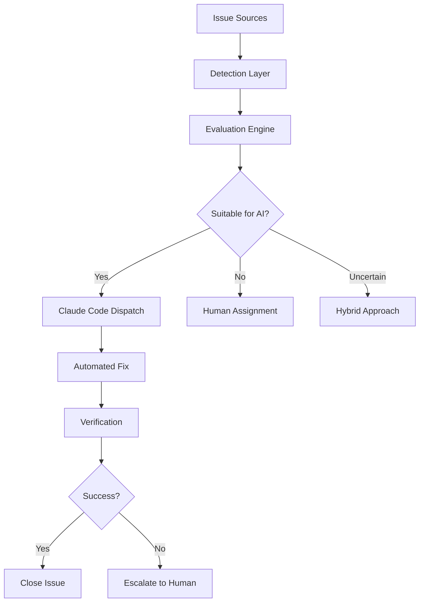

# Chapter 11: Automated Issue Detection and Dispatch

True autonomous development requires systems that can detect, evaluate, and automatically respond to issues without human intervention. This chapter explores building intelligent dispatch systems that monitor for problems, assess their severity and complexity, and determine whether Claude Code should handle them autonomously.

## The Autonomous Issue Pipeline

### Core Components

An effective autonomous issue system consists of four main components:

1. **Detection Layer**: Monitors multiple sources for issues
2. **Evaluation Engine**: Assesses issue complexity and suitability for automation
3. **Dispatch System**: Routes issues to appropriate handlers
4. **Execution Engine**: Implements fixes and monitors results



## Issue Detection Systems

### GitHub Webhook Integration

Monitor repository activity in real-time:

```javascript
// webhook-handler.js - Express server for GitHub webhooks
const express = require('express');
const crypto = require('crypto');
const { IssueDispatcher } = require('./issue-dispatcher');

class GitHubWebhookHandler {
  constructor() {
    this.app = express();
    this.dispatcher = new IssueDispatcher();
    this.setupMiddleware();
    this.setupRoutes();
  }

  setupMiddleware() {
    this.app.use(express.json({ limit: '10mb' }));
    this.app.use(this.verifyWebhookSignature.bind(this));
  }

  verifyWebhookSignature(req, res, next) {
    const signature = req.headers['x-hub-signature-256'];
    const payload = JSON.stringify(req.body);
    const secret = process.env.GITHUB_WEBHOOK_SECRET;
    
    const hmac = crypto.createHmac('sha256', secret);
    const digest = 'sha256=' + hmac.update(payload).digest('hex');
    
    if (!crypto.timingSafeEqual(Buffer.from(signature), Buffer.from(digest))) {
      return res.status(401).send('Unauthorized');
    }
    
    next();
  }

  setupRoutes() {
    this.app.post('/webhook/github', async (req, res) => {
      const event = req.headers['x-github-event'];
      const payload = req.body;
      
      try {
        await this.handleWebhookEvent(event, payload);
        res.status(200).send('OK');
      } catch (error) {
        console.error('Webhook handling error:', error);
        res.status(500).send('Internal Server Error');
      }
    });
  }

  async handleWebhookEvent(event, payload) {
    switch (event) {
      case 'issues':
        await this.handleIssueEvent(payload);
        break;
      case 'pull_request':
        await this.handlePullRequestEvent(payload);
        break;
      case 'push':
        await this.handlePushEvent(payload);
        break;
      case 'workflow_run':
        await this.handleWorkflowEvent(payload);
        break;
      case 'check_run':
        await this.handleCheckRunEvent(payload);
        break;
      default:
        console.log(`Unhandled event: ${event}`);
    }
  }

  async handleIssueEvent(payload) {
    const { action, issue, repository } = payload;
    
    if (action === 'opened' || action === 'labeled') {
      const issueData = {
        id: issue.id,
        number: issue.number,
        title: issue.title,
        body: issue.body,
        labels: issue.labels.map(l => l.name),
        author: issue.user.login,
        repository: repository.full_name,
        url: issue.html_url,
        created_at: issue.created_at,
        priority: this.extractPriority(issue),
        type: this.classifyIssueType(issue)
      };
      
      await this.dispatcher.evaluateAndDispatch(issueData);
    }
  }

  async handleWorkflowEvent(payload) {
    const { action, workflow_run, repository } = payload;
    
    if (action === 'completed' && workflow_run.conclusion === 'failure') {
      const failureData = {
        type: 'ci_failure',
        repository: repository.full_name,
        workflow_name: workflow_run.name,
        run_id: workflow_run.id,
        commit: workflow_run.head_sha,
        branch: workflow_run.head_branch,
        url: workflow_run.html_url,
        logs_url: workflow_run.logs_url
      };
      
      await this.dispatcher.handleCIFailure(failureData);
    }
  }

  extractPriority(issue) {
    const priorityLabels = ['P0', 'P1', 'P2', 'P3', 'critical', 'high', 'medium', 'low'];
    const label = issue.labels.find(l => 
      priorityLabels.some(p => l.name.toLowerCase().includes(p.toLowerCase()))
    );
    
    if (!label) return 'medium';
    
    const name = label.name.toLowerCase();
    if (name.includes('p0') || name.includes('critical')) return 'critical';
    if (name.includes('p1') || name.includes('high')) return 'high';
    if (name.includes('p2') || name.includes('medium')) return 'medium';
    return 'low';
  }

  classifyIssueType(issue) {
    const title = issue.title.toLowerCase();
    const body = (issue.body || '').toLowerCase();
    const labels = issue.labels.map(l => l.name.toLowerCase());
    
    if (labels.includes('bug') || title.includes('bug') || title.includes('error')) {
      return 'bug';
    }
    if (labels.includes('enhancement') || labels.includes('feature') || title.includes('feature')) {
      return 'feature';
    }
    if (labels.includes('documentation') || title.includes('docs')) {
      return 'documentation';
    }
    if (title.includes('test') || body.includes('test')) {
      return 'testing';
    }
    
    return 'general';
  }
}
```

### Polling-Based Issue Detection

For platforms without webhook support or additional monitoring needs:

```javascript
// issue-poller.js
class IssuePoller {
  constructor() {
    this.sources = new Map();
    this.dispatcher = new IssueDispatcher();
    this.intervals = new Map();
    this.lastChecked = new Map();
  }

  addSource(name, config) {
    this.sources.set(name, {
      ...config,
      enabled: true,
      lastError: null,
      errorCount: 0
    });
    
    this.lastChecked.set(name, new Date());
  }

  startPolling() {
    for (const [name, config] of this.sources) {
      if (config.enabled) {
        const interval = setInterval(
          () => this.pollSource(name),
          config.interval || 60000 // Default 1 minute
        );
        
        this.intervals.set(name, interval);
        console.log(`Started polling ${name} every ${config.interval || 60000}ms`);
      }
    }
  }

  stopPolling() {
    for (const [name, interval] of this.intervals) {
      clearInterval(interval);
      console.log(`Stopped polling ${name}`);
    }
    this.intervals.clear();
  }

  async pollSource(sourceName) {
    const source = this.sources.get(sourceName);
    if (!source || !source.enabled) return;

    try {
      const lastChecked = this.lastChecked.get(sourceName);
      const newIssues = await this.fetchNewIssues(source, lastChecked);
      
      for (const issue of newIssues) {
        await this.dispatcher.evaluateAndDispatch(issue);
      }
      
      this.lastChecked.set(sourceName, new Date());
      
      // Reset error count on success
      if (source.errorCount > 0) {
        source.errorCount = 0;
        source.lastError = null;
        console.log(`${sourceName} polling recovered`);
      }
      
    } catch (error) {
      source.errorCount++;
      source.lastError = error.message;
      
      console.error(`Error polling ${sourceName}:`, error);
      
      // Disable source after too many failures
      if (source.errorCount >= 5) {
        source.enabled = false;
        console.error(`Disabled ${sourceName} due to repeated failures`);
        
        // Notify administrators
        await this.notifySourceFailure(sourceName, source);
      }
    }
  }

  async fetchNewIssues(source, since) {
    switch (source.type) {
      case 'github':
        return await this.fetchGitHubIssues(source, since);
      case 'jira':
        return await this.fetchJiraIssues(source, since);
      case 'sentry':
        return await this.fetchSentryIssues(source, since);
      case 'monitoring':
        return await this.fetchMonitoringAlerts(source, since);
      default:
        throw new Error(`Unknown source type: ${source.type}`);
    }
  }

  async fetchGitHubIssues(source, since) {
    const { Octokit } = require('@octokit/rest');
    const octokit = new Octokit({ auth: source.token });
    
    const response = await octokit.issues.listForRepo({
      owner: source.owner,
      repo: source.repo,
      state: 'open',
      since: since.toISOString(),
      sort: 'created',
      direction: 'desc'
    });
    
    return response.data.map(issue => ({
      id: issue.id,
      number: issue.number,
      title: issue.title,
      body: issue.body,
      labels: issue.labels.map(l => l.name),
      author: issue.user.login,
      repository: `${source.owner}/${source.repo}`,
      url: issue.html_url,
      created_at: issue.created_at,
      priority: this.extractPriority(issue),
      type: this.classifyIssueType(issue)
    }));
  }

  async fetchSentryIssues(source, since) {
    const response = await fetch(`${source.url}/api/0/projects/${source.project}/issues/`, {
      headers: {
        'Authorization': `Bearer ${source.token}`,
        'Content-Type': 'application/json'
      },
      method: 'GET'
    });
    
    const issues = await response.json();
    
    return issues
      .filter(issue => new Date(issue.firstSeen) > since)
      .map(issue => ({
        id: issue.id,
        title: issue.title || issue.metadata.type,
        body: this.formatSentryIssue(issue),
        priority: this.mapSentryPriority(issue.level),
        type: 'bug',
        source: 'sentry',
        repository: source.repository,
        url: `${source.url}/${source.organization}/${source.project}/issues/${issue.id}/`,
        metadata: {
          level: issue.level,
          count: issue.count,
          platform: issue.platform,
          environment: issue.tags?.environment?.[0]
        }
      }));
  }

  formatSentryIssue(issue) {
    return `
## Error Details
- **Type**: ${issue.metadata.type}
- **Value**: ${issue.metadata.value}
- **Platform**: ${issue.platform}
- **Environment**: ${issue.tags?.environment?.[0] || 'unknown'}
- **Count**: ${issue.count} occurrences
- **First Seen**: ${issue.firstSeen}
- **Last Seen**: ${issue.lastSeen}

## Stack Trace
\`\`\`
${issue.entries?.[0]?.data?.stacktrace?.frames?.slice(-5).map(frame => 
  `${frame.filename}:${frame.lineno} in ${frame.function}`
).join('\n') || 'No stack trace available'}
\`\`\`
    `.trim();
  }
}

// Configuration example
const poller = new IssuePoller();

poller.addSource('main-repo', {
  type: 'github',
  owner: 'myorg',
  repo: 'main-app',
  token: process.env.GITHUB_TOKEN,
  interval: 30000 // 30 seconds
});

poller.addSource('error-monitoring', {
  type: 'sentry',
  url: 'https://sentry.io',
  organization: 'myorg',
  project: 'main-app',
  token: process.env.SENTRY_TOKEN,
  repository: 'myorg/main-app',
  interval: 60000 // 1 minute
});

poller.startPolling();
```

## Issue Evaluation Engine

### Intelligent Issue Classification

Determine if Claude Code should handle an issue autonomously:

```javascript
// issue-evaluator.js
class IssueEvaluator {
  constructor() {
    this.rules = this.loadEvaluationRules();
    this.patterns = this.loadKnownPatterns();
    this.capabilities = this.loadClaudeCodeCapabilities();
  }

  async evaluateIssue(issue) {
    const analysis = {
      issue,
      complexity: await this.assessComplexity(issue),
      confidence: await this.assessConfidence(issue),
      risk: await this.assessRisk(issue),
      suitability: 'unknown',
      reasoning: [],
      recommendations: []
    };

    // Apply evaluation rules
    for (const rule of this.rules) {
      const result = await rule.evaluate(analysis);
      if (result.matches) {
        analysis.suitability = result.suitability;
        analysis.reasoning.push(result.reasoning);
        
        if (result.recommendations) {
          analysis.recommendations.push(...result.recommendations);
        }
        
        if (result.final) break; // Stop at first final rule match
      }
    }

    return analysis;
  }

  async assessComplexity(issue) {
    const factors = {
      textComplexity: this.analyzeTextComplexity(issue.title, issue.body),
      technicalDepth: this.assessTechnicalDepth(issue),
      scopeSize: this.assessScopeSize(issue),
      dependencies: this.assessDependencies(issue)
    };

    const weights = { textComplexity: 0.2, technicalDepth: 0.4, scopeSize: 0.3, dependencies: 0.1 };
    const score = Object.entries(factors).reduce((acc, [key, value]) => 
      acc + (value * weights[key]), 0
    );

    return {
      score: Math.round(score * 100) / 100,
      factors,
      level: score < 0.3 ? 'low' : score < 0.7 ? 'medium' : 'high'
    };
  }

  analyzeTextComplexity(title, body) {
    const text = `${title} ${body || ''}`.toLowerCase();
    
    // Simple heuristics for complexity
    const complexityIndicators = [
      'architecture', 'design', 'refactor', 'migration', 'integration',
      'performance', 'security', 'database', 'algorithm', 'optimization'
    ];
    
    const simplicityIndicators = [
      'typo', 'spelling', 'format', 'style', 'lint', 'test', 'log',
      'comment', 'documentation', 'readme', 'changelog'
    ];
    
    const complexScore = complexityIndicators.filter(word => text.includes(word)).length;
    const simpleScore = simplicityIndicators.filter(word => text.includes(word)).length;
    
    if (simpleScore > complexScore) return 0.2;
    if (complexScore > simpleScore * 2) return 0.8;
    return 0.5;
  }

  async assessConfidence(issue) {
    const confidence = {
      patternMatch: this.checkKnownPatterns(issue),
      similarityScore: await this.findSimilarResolvedIssues(issue),
      capabilityMatch: this.checkCapabilityMatch(issue),
      contextAvailable: this.assessAvailableContext(issue)
    };

    const weights = { patternMatch: 0.3, similarityScore: 0.3, capabilityMatch: 0.3, contextAvailable: 0.1 };
    const score = Object.entries(confidence).reduce((acc, [key, value]) => 
      acc + (value * weights[key]), 0
    );

    return {
      score: Math.round(score * 100) / 100,
      factors: confidence,
      level: score < 0.4 ? 'low' : score < 0.7 ? 'medium' : 'high'
    };
  }

  checkKnownPatterns(issue) {
    const text = `${issue.title} ${issue.body || ''}`.toLowerCase();
    
    for (const pattern of this.patterns) {
      if (pattern.regex.test(text) || pattern.keywords.some(kw => text.includes(kw))) {
        return pattern.confidence;
      }
    }
    
    return 0.1; // Default low confidence for unknown patterns
  }

  async findSimilarResolvedIssues(issue) {
    // In a real implementation, this would query a database of resolved issues
    // and use semantic similarity to find matches
    const mockSimilarIssues = [
      { similarity: 0.85, outcome: 'success' },
      { similarity: 0.72, outcome: 'success' },
      { similarity: 0.65, outcome: 'failure' }
    ];
    
    const relevantIssues = mockSimilarIssues.filter(i => i.similarity > 0.6);
    if (relevantIssues.length === 0) return 0.2;
    
    const successRate = relevantIssues.filter(i => i.outcome === 'success').length / relevantIssues.length;
    const avgSimilarity = relevantIssues.reduce((acc, i) => acc + i.similarity, 0) / relevantIssues.length;
    
    return successRate * avgSimilarity;
  }

  loadEvaluationRules() {
    return [
      {
        name: 'simple-fixes',
        evaluate: (analysis) => {
          const { issue, complexity } = analysis;
          const simplePatterns = [
            /typo|spelling|grammar/i,
            /missing.*import/i,
            /unused.*variable/i,
            /deprecated.*warning/i,
            /lint.*error/i,
            /format.*code/i
          ];
          
          const isSimple = simplePatterns.some(pattern => 
            pattern.test(issue.title) || pattern.test(issue.body || '')
          );
          
          if (isSimple && complexity.level === 'low') {
            return {
              matches: true,
              suitability: 'high',
              reasoning: 'Simple fix pattern with low complexity',
              final: true
            };
          }
          
          return { matches: false };
        }
      },
      
      {
        name: 'test-related',
        evaluate: (analysis) => {
          const { issue } = analysis;
          const testPatterns = [
            /test.*fail/i,
            /add.*test/i,
            /test.*coverage/i,
            /unit.*test/i,
            /integration.*test/i
          ];
          
          const isTestRelated = testPatterns.some(pattern => 
            pattern.test(issue.title) || pattern.test(issue.body || '')
          );
          
          if (isTestRelated) {
            return {
              matches: true,
              suitability: 'high',
              reasoning: 'Test-related issues are well-suited for automation',
              recommendations: ['run-tests', 'analyze-coverage', 'generate-tests']
            };
          }
          
          return { matches: false };
        }
      },
      
      {
        name: 'documentation',
        evaluate: (analysis) => {
          const { issue } = analysis;
          const docPatterns = [
            /documentation|docs/i,
            /readme/i,
            /comment/i,
            /jsdoc/i,
            /api.*document/i
          ];
          
          const isDocumentation = docPatterns.some(pattern => 
            pattern.test(issue.title) || pattern.test(issue.body || '') ||
            issue.labels?.includes('documentation')
          );
          
          if (isDocumentation) {
            return {
              matches: true,
              suitability: 'medium',
              reasoning: 'Documentation updates can be automated with verification',
              recommendations: ['analyze-code', 'generate-docs', 'verify-accuracy']
            };
          }
          
          return { matches: false };
        }
      },
      
      {
        name: 'security-issues',
        evaluate: (analysis) => {
          const { issue } = analysis;
          const securityPatterns = [
            /security|vulnerability/i,
            /xss|sql.*injection|csrf/i,
            /auth|permission/i,
            /secret|key.*leak/i
          ];
          
          const isSecurity = securityPatterns.some(pattern => 
            pattern.test(issue.title) || pattern.test(issue.body || '') ||
            issue.labels?.includes('security')
          );
          
          if (isSecurity) {
            return {
              matches: true,
              suitability: 'low', // Require human oversight for security
              reasoning: 'Security issues require human review and approval',
              recommendations: ['security-scan', 'human-review-required'],
              final: true
            };
          }
          
          return { matches: false };
        }
      },
      
      {
        name: 'high-complexity',
        evaluate: (analysis) => {
          const { complexity, risk } = analysis;
          
          if (complexity.level === 'high' || risk.level === 'high') {
            return {
              matches: true,
              suitability: 'low',
              reasoning: 'High complexity or risk requires human oversight',
              recommendations: ['human-review', 'break-down-task'],
              final: true
            };
          }
          
          return { matches: false };
        }
      }
    ];
  }

  loadKnownPatterns() {
    return [
      {
        name: 'linting-error',
        regex: /eslint|lint.*error|prettier/i,
        keywords: ['eslint', 'linting', 'prettier', 'code style'],
        confidence: 0.9,
        automated: true
      },
      {
        name: 'dependency-update',
        regex: /update.*dependency|upgrade.*package|vulnerability.*fix/i,
        keywords: ['npm audit', 'security vulnerability', 'outdated package'],
        confidence: 0.8,
        automated: true
      },
      {
        name: 'test-failure',
        regex: /test.*fail|failing.*test|test.*broke/i,
        keywords: ['test failure', 'broken test', 'test suite'],
        confidence: 0.85,
        automated: true
      },
      {
        name: 'build-failure',
        regex: /build.*fail|compilation.*error|build.*broke/i,
        keywords: ['build error', 'compilation failed', 'ci failure'],
        confidence: 0.8,
        automated: true
      }
    ];
  }
}
```

## Intelligent Dispatch System

### Task Routing and Assignment

```javascript
// issue-dispatcher.js
class IssueDispatcher {
  constructor() {
    this.evaluator = new IssueEvaluator();
    this.executors = new Map();
    this.queue = [];
    this.activeJobs = new Map();
    this.config = this.loadDispatchConfig();
    
    this.setupExecutors();
  }

  setupExecutors() {
    // Register different types of executors
    this.executors.set('claude-code', new ClaudeCodeExecutor());
    this.executors.set('human', new HumanAssignmentExecutor());
    this.executors.set('hybrid', new HybridExecutor());
  }

  async evaluateAndDispatch(issue) {
    console.log(`Evaluating issue: ${issue.title}`);
    
    const evaluation = await this.evaluator.evaluateIssue(issue);
    const dispatchDecision = this.makeDispatchDecision(evaluation);
    
    const job = {
      id: this.generateJobId(),
      issue,
      evaluation,
      dispatchDecision,
      createdAt: new Date(),
      status: 'queued'
    };

    await this.dispatchJob(job);
    return job;
  }

  makeDispatchDecision(evaluation) {
    const { suitability, complexity, confidence, risk } = evaluation;
    
    // Decision matrix based on evaluation factors
    if (suitability === 'high' && confidence.level === 'high' && risk.level === 'low') {
      return {
        executor: 'claude-code',
        mode: 'autonomous',
        priority: this.calculatePriority(evaluation),
        approvalRequired: false
      };
    }
    
    if (suitability === 'medium' && confidence.level === 'medium') {
      return {
        executor: 'hybrid',
        mode: 'supervised',
        priority: this.calculatePriority(evaluation),
        approvalRequired: true
      };
    }
    
    if (suitability === 'low' || risk.level === 'high') {
      return {
        executor: 'human',
        mode: 'manual',
        priority: this.calculatePriority(evaluation),
        approvalRequired: false
      };
    }
    
    // Default to human review for uncertain cases
    return {
      executor: 'human',
      mode: 'manual',
      priority: 'medium',
      approvalRequired: false,
      reason: 'Uncertain evaluation, defaulting to human review'
    };
  }

  async dispatchJob(job) {
    const { executor: executorType, mode, approvalRequired } = job.dispatchDecision;
    
    if (approvalRequired) {
      await this.requestApproval(job);
      job.status = 'awaiting_approval';
    } else {
      await this.executeJob(job);
    }
    
    this.activeJobs.set(job.id, job);
    this.logDispatch(job);
  }

  async executeJob(job) {
    const executorType = job.dispatchDecision.executor;
    const executor = this.executors.get(executorType);
    
    if (!executor) {
      throw new Error(`Unknown executor type: ${executorType}`);
    }
    
    job.status = 'executing';
    job.startedAt = new Date();
    
    try {
      const result = await executor.execute(job);
      job.result = result;
      job.status = result.success ? 'completed' : 'failed';
      job.completedAt = new Date();
      
      await this.handleJobCompletion(job);
      
    } catch (error) {
      job.error = error.message;
      job.status = 'error';
      job.completedAt = new Date();
      
      await this.handleJobError(job);
    }
  }

  async requestApproval(job) {
    const approvalRequest = {
      jobId: job.id,
      issue: job.issue,
      evaluation: job.evaluation,
      proposedAction: job.dispatchDecision,
      requestedAt: new Date()
    };
    
    // Send approval request via configured channels
    await this.sendApprovalRequest(approvalRequest);
    
    // Set up timeout for approval
    setTimeout(() => {
      if (job.status === 'awaiting_approval') {
        job.status = 'approval_timeout';
        this.handleApprovalTimeout(job);
      }
    }, this.config.approvalTimeoutMs);
  }

  async sendApprovalRequest(request) {
    // Implementation depends on your notification system
    const message = this.formatApprovalMessage(request);
    
    // Example: Send to Slack
    if (this.config.slack?.approvalChannel) {
      await this.sendSlackMessage(this.config.slack.approvalChannel, message);
    }
    
    // Example: Send email
    if (this.config.email?.approvers) {
      await this.sendEmail(this.config.email.approvers, 'Claude Code Approval Request', message);
    }
    
    // Example: Create GitHub issue comment
    if (request.issue.repository) {
      await this.createGitHubComment(request.issue, message);
    }
  }

  formatApprovalMessage(request) {
    const { issue, evaluation, proposedAction } = request;
    
    return `
🤖 **Claude Code Approval Request**

**Issue**: ${issue.title}
**Repository**: ${issue.repository}
**URL**: ${issue.url}

**Evaluation Summary**:
- Complexity: ${evaluation.complexity.level}
- Confidence: ${evaluation.confidence.level}
- Risk: ${evaluation.risk.level}
- Suitability: ${evaluation.suitability}

**Proposed Action**: ${proposedAction.mode} execution via ${proposedAction.executor}

**Reasoning**: ${evaluation.reasoning.join(', ')}

To approve: Reply with \`/approve ${request.jobId}\`
To reject: Reply with \`/reject ${request.jobId} [reason]\`
To modify: Reply with \`/modify ${request.jobId} [instructions]\`
    `.trim();
  }

  calculatePriority(evaluation) {
    const { issue, complexity, risk } = evaluation;
    
    // Start with issue priority if available
    let priority = issue.priority || 'medium';
    
    // Adjust based on complexity and risk
    if (risk.level === 'high') priority = 'high';
    if (complexity.level === 'low' && priority === 'medium') priority = 'high'; // Easy wins
    
    // Consider issue type
    if (issue.type === 'bug' && issue.labels?.includes('production')) {
      priority = 'critical';
    }
    
    return priority;
  }
}

// Claude Code executor implementation
class ClaudeCodeExecutor {
  async execute(job) {
    const { issue, evaluation } = job;
    
    // Create execution context
    const context = await this.createExecutionContext(issue, evaluation);
    
    // Generate execution plan
    const plan = await this.generateExecutionPlan(context);
    
    // Execute the plan
    const result = await this.executePlan(plan, context);
    
    return result;
  }

  async createExecutionContext(issue, evaluation) {
    return {
      issue,
      evaluation,
      repository: await this.cloneRepository(issue.repository),
      workingBranch: `fix/issue-${issue.number}-${Date.now()}`,
      tools: this.getAvailableTools(evaluation),
      constraints: this.getExecutionConstraints(evaluation)
    };
  }

  async generateExecutionPlan(context) {
    const { issue, evaluation } = context;
    
    const plan = {
      steps: [],
      estimatedTime: 0,
      riskLevel: evaluation.risk.level
    };
    
    // Add steps based on issue type and evaluation
    if (evaluation.recommendations.includes('run-tests')) {
      plan.steps.push({ type: 'run_tests', description: 'Run existing test suite' });
    }
    
    if (issue.type === 'bug') {
      plan.steps.push(
        { type: 'analyze_code', description: 'Analyze codebase for bug source' },
        { type: 'create_fix', description: 'Implement bug fix' },
        { type: 'add_tests', description: 'Add regression tests' }
      );
    }
    
    if (issue.type === 'feature') {
      plan.steps.push(
        { type: 'design_implementation', description: 'Design feature implementation' },
        { type: 'implement_feature', description: 'Implement new feature' },
        { type: 'add_tests', description: 'Add feature tests' },
        { type: 'update_docs', description: 'Update documentation' }
      );
    }
    
    // Always end with verification
    plan.steps.push(
      { type: 'run_full_tests', description: 'Run complete test suite' },
      { type: 'create_pr', description: 'Create pull request with changes' }
    );
    
    return plan;
  }

  async executePlan(plan, context) {
    const results = [];
    
    for (const step of plan.steps) {
      try {
        console.log(`Executing step: ${step.description}`);
        const stepResult = await this.executeStep(step, context);
        results.push(stepResult);
        
        if (!stepResult.success) {
          return {
            success: false,
            error: `Step failed: ${step.description}`,
            results
          };
        }
        
      } catch (error) {
        return {
          success: false,
          error: error.message,
          failedStep: step,
          results
        };
      }
    }
    
    return {
      success: true,
      results,
      pullRequest: results.find(r => r.type === 'create_pr')?.url
    };
  }

  async executeStep(step, context) {
    // This would integrate with your actual Claude Code implementation
    switch (step.type) {
      case 'run_tests':
        return await this.runTests(context);
      case 'analyze_code':
        return await this.analyzeCode(context);
      case 'create_fix':
        return await this.createFix(context);
      case 'implement_feature':
        return await this.implementFeature(context);
      case 'add_tests':
        return await this.addTests(context);
      case 'create_pr':
        return await this.createPullRequest(context);
      default:
        throw new Error(`Unknown step type: ${step.type}`);
    }
  }
}
```

## Daemon Process Architecture

### Long-Running Dispatch Service

```javascript
// dispatch-daemon.js
class DispatchDaemon {
  constructor() {
    this.dispatcher = new IssueDispatcher();
    this.poller = new IssuePoller();
    this.webhookHandler = new GitHubWebhookHandler();
    this.isRunning = false;
    this.config = this.loadDaemonConfig();
    
    this.setupSignalHandlers();
    this.setupHealthChecks();
  }

  async start() {
    if (this.isRunning) {
      console.log('Daemon already running');
      return;
    }

    console.log('Starting Claude Code Dispatch Daemon...');
    
    try {
      // Start webhook server
      await this.webhookHandler.start(this.config.webhookPort);
      console.log(`Webhook server listening on port ${this.config.webhookPort}`);
      
      // Start polling services
      this.poller.startPolling();
      console.log('Issue polling started');
      
      // Start job queue processor
      this.startJobProcessor();
      console.log('Job processor started');
      
      // Start health monitoring
      this.startHealthMonitoring();
      console.log('Health monitoring started');
      
      this.isRunning = true;
      console.log('✅ Claude Code Dispatch Daemon is running');
      
    } catch (error) {
      console.error('Failed to start daemon:', error);
      process.exit(1);
    }
  }

  async stop() {
    if (!this.isRunning) return;
    
    console.log('Stopping Claude Code Dispatch Daemon...');
    
    this.isRunning = false;
    
    // Stop all services
    this.poller.stopPolling();
    await this.webhookHandler.stop();
    
    console.log('✅ Daemon stopped gracefully');
  }

  setupSignalHandlers() {
    process.on('SIGTERM', async () => {
      console.log('Received SIGTERM, shutting down gracefully...');
      await this.stop();
      process.exit(0);
    });
    
    process.on('SIGINT', async () => {
      console.log('Received SIGINT, shutting down gracefully...');
      await this.stop();
      process.exit(0);
    });
  }

  startJobProcessor() {
    setInterval(async () => {
      if (!this.isRunning) return;
      
      try {
        await this.processJobQueue();
      } catch (error) {
        console.error('Job processor error:', error);
      }
    }, this.config.jobProcessingInterval || 5000);
  }

  async processJobQueue() {
    const pendingJobs = this.dispatcher.getPendingJobs();
    const concurrentLimit = this.config.maxConcurrentJobs || 3;
    const activeJobs = this.dispatcher.getActiveJobs();
    
    if (activeJobs.length >= concurrentLimit) {
      return; // Wait for current jobs to complete
    }
    
    const availableSlots = concurrentLimit - activeJobs.length;
    const jobsToProcess = pendingJobs.slice(0, availableSlots);
    
    for (const job of jobsToProcess) {
      await this.dispatcher.executeJob(job);
    }
  }

  startHealthMonitoring() {
    const healthCheckInterval = this.config.healthCheckInterval || 60000; // 1 minute
    
    setInterval(async () => {
      if (!this.isRunning) return;
      
      const health = await this.checkHealth();
      
      if (!health.healthy) {
        console.error('Health check failed:', health);
        await this.handleUnhealthyState(health);
      }
    }, healthCheckInterval);
  }

  async checkHealth() {
    const checks = {
      dispatcher: this.dispatcher.isHealthy(),
      poller: this.poller.isHealthy(),
      webhookHandler: this.webhookHandler.isHealthy(),
      memoryUsage: this.checkMemoryUsage(),
      diskSpace: await this.checkDiskSpace()
    };
    
    const healthy = Object.values(checks).every(check => check.healthy);
    
    return {
      healthy,
      checks,
      timestamp: new Date().toISOString()
    };
  }

  loadDaemonConfig() {
    return {
      webhookPort: process.env.WEBHOOK_PORT || 3000,
      jobProcessingInterval: 5000,
      maxConcurrentJobs: 3,
      healthCheckInterval: 60000,
      maxMemoryUsage: 0.8, // 80% of available memory
      minDiskSpace: 1024 * 1024 * 1024 // 1GB
    };
  }
}

// Start the daemon
if (require.main === module) {
  const daemon = new DispatchDaemon();
  daemon.start().catch(error => {
    console.error('Failed to start daemon:', error);
    process.exit(1);
  });
}

module.exports = { DispatchDaemon };
```

## Configuration and Deployment

### Docker Deployment

```dockerfile
# Dockerfile
FROM node:18-alpine

WORKDIR /app

# Install system dependencies
RUN apk add --no-cache git curl

# Copy package files
COPY package*.json ./
RUN npm ci --only=production

# Copy application code
COPY . .

# Create non-root user
RUN addgroup -g 1001 -S nodejs
RUN adduser -S claude -u 1001
RUN chown -R claude:nodejs /app
USER claude

# Health check
HEALTHCHECK --interval=30s --timeout=10s --start-period=5s --retries=3 \
  CMD curl -f http://localhost:3000/health || exit 1

# Start the daemon
CMD ["node", "dispatch-daemon.js"]
```

### Kubernetes Deployment

```yaml
# k8s-deployment.yaml
apiVersion: apps/v1
kind: Deployment
metadata:
  name: claude-code-dispatcher
  labels:
    app: claude-code-dispatcher
spec:
  replicas: 2
  selector:
    matchLabels:
      app: claude-code-dispatcher
  template:
    metadata:
      labels:
        app: claude-code-dispatcher
    spec:
      containers:
      - name: dispatcher
        image: claude-code-dispatcher:latest
        ports:
        - containerPort: 3000
        env:
        - name: GITHUB_TOKEN
          valueFrom:
            secretKeyRef:
              name: github-credentials
              key: token
        - name: SENTRY_TOKEN
          valueFrom:
            secretKeyRef:
              name: sentry-credentials
              key: token
        - name: WEBHOOK_SECRET
          valueFrom:
            secretKeyRef:
              name: webhook-secrets
              key: github
        resources:
          requests:
            memory: "256Mi"
            cpu: "100m"
          limits:
            memory: "512Mi"
            cpu: "500m"
        livenessProbe:
          httpGet:
            path: /health
            port: 3000
          initialDelaySeconds: 30
          periodSeconds: 10
        readinessProbe:
          httpGet:
            path: /ready
            port: 3000
          initialDelaySeconds: 5
          periodSeconds: 5
---
apiVersion: v1
kind: Service
metadata:
  name: claude-code-dispatcher-service
spec:
  selector:
    app: claude-code-dispatcher
  ports:
  - protocol: TCP
    port: 80
    targetPort: 3000
  type: LoadBalancer
```

## Monitoring and Analytics

### Dispatch Analytics Dashboard

```javascript
// analytics.js
class DispatchAnalytics {
  constructor() {
    this.metrics = new Map();
    this.events = [];
  }

  recordDispatch(job) {
    const event = {
      timestamp: new Date(),
      type: 'dispatch',
      jobId: job.id,
      issueType: job.issue.type,
      executor: job.dispatchDecision.executor,
      complexity: job.evaluation.complexity.level,
      confidence: job.evaluation.confidence.level,
      priority: job.dispatchDecision.priority
    };
    
    this.events.push(event);
    this.updateMetrics(event);
  }

  recordCompletion(job) {
    const event = {
      timestamp: new Date(),
      type: 'completion',
      jobId: job.id,
      success: job.result.success,
      duration: job.completedAt - job.startedAt,
      executor: job.dispatchDecision.executor
    };
    
    this.events.push(event);
    this.updateMetrics(event);
  }

  generateReport(timeRange = '24h') {
    const cutoff = this.getTimeRangeCutoff(timeRange);
    const relevantEvents = this.events.filter(e => e.timestamp > cutoff);
    
    return {
      summary: this.generateSummary(relevantEvents),
      dispatches: this.analyzeDispatches(relevantEvents),
      completions: this.analyzeCompletions(relevantEvents),
      performance: this.analyzePerformance(relevantEvents),
      trends: this.analyzeTrends(relevantEvents)
    };
  }

  generateSummary(events) {
    const dispatches = events.filter(e => e.type === 'dispatch');
    const completions = events.filter(e => e.type === 'completion');
    
    return {
      totalIssuesProcessed: dispatches.length,
      successfulCompletions: completions.filter(e => e.success).length,
      averageResolutionTime: this.calculateAverageResolutionTime(completions),
      automationRate: dispatches.filter(e => e.executor === 'claude-code').length / dispatches.length,
      topIssueTypes: this.getTopIssueTypes(dispatches)
    };
  }
}
```

This comprehensive system enables truly autonomous issue handling, from detection through resolution, while maintaining appropriate human oversight and safety measures. The dispatch daemon can run continuously, monitoring for issues and automatically resolving those within Claude Code's capabilities.